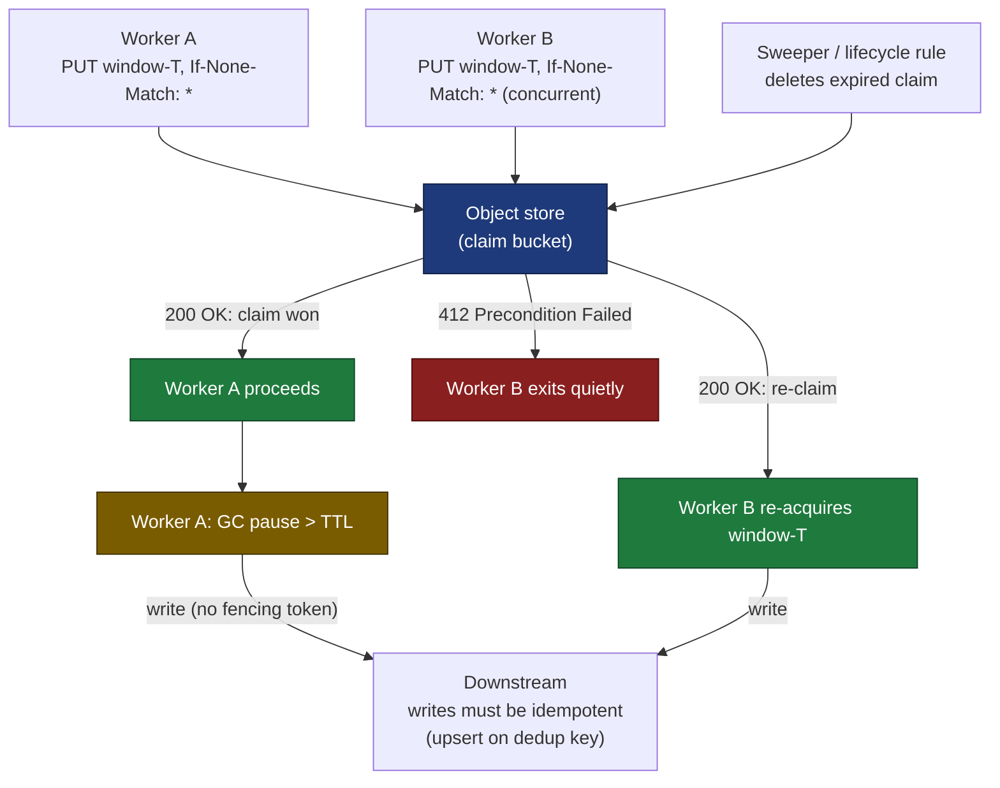

# A distributed lock out of your object store

I had a fleet of stateless workers (think AWS Lambda functions, the small programs that spin up to handle a single event and then vanish, holding no memory between runs), each woken by the same fan-out event (one event delivered to many workers at once), each fully capable of picking up the same unit of work. Exactly one was supposed to run per window. There was no Redis in the diagram, no ZooKeeper, no lock table, and standing one up felt absurd for a job that fired a few hundred times a day. So I leaned on the object store I already had, the bucket of files in the cloud (an Amazon S3 bucket, say) that the system was using for other things anyway. For a few weeks it was perfect. Then two workers processed the same window, neither log showed an error, and I spent half a day I would like back learning which guarantee I had actually been renting.

The mechanism itself is sound. The trap is that "sound" leans on a setting you never wrote, cannot see in your code, and someone else can change.

## The problem: fan-out with no coordinator

The shape is common. A single event fans out (gets delivered to many consumers at once) to N identical consumers: a queue with multiple pollers, a function that scales horizontally by running more copies of itself under load, a deployment with several replicas. Each consumer is correct on its own. The only thing wrong is that more than one of them runs.

The textbook answer is a coordination service, a separate system whose only job is to let exactly one worker hold a lock at a time. Acquire the lock, do the work, release it. That is the right call when you need strict mutual exclusion, a hard guarantee that two workers can never touch the same thing at once. It is also a new stateful dependency to provision, monitor, fail over, and reason about, and for low-frequency work it dwarfs the job it guards. Every coordination service you bolt on is another thing that can break at 3am, which is why the cheapest correct coordinator is usually one you already run. If your stack already includes an object store, you may already own a usable one.

## The primitive: a conditional PUT and the 412

First, why this works at all. Object stores now expose a compare-and-set on key creation, an operation that writes a value only if a condition holds, all in one indivisible step that no other writer can wedge into. Here the condition is simply "this key does not exist yet." On S3 you send a PUT (the HTTP request that creates or overwrites an object) carrying the `If-None-Match: *` header, and the [write succeeds only if the key does not already exist](https://docs.aws.amazon.com/AmazonS3/latest/userguide/conditional-writes.html). The first worker to create the key wins with a `200 OK`. Everyone else gets `HTTP 412 Precondition Failed`, the status code that means "your if-condition was false, so I did nothing," and exits quietly. As the S3 documentation puts it, the first write operation to finish is the one that succeeds.

```http
PUT /claims/window-2026-07-01T12:00 HTTP/1.1
If-None-Match: *

{ "worker": "w-3f9a", "expires_at": 1751370000 }
```

```python
try:
    s3.put_object(Bucket=bucket, Key=key, Body=body, IfNoneMatch="*")
    # we won the claim; do the work
except s3.exceptions.ClientError as e:
    if e.response["Error"]["Code"] == "PreconditionFailed":
        return  # someone else owns this window; exit clean
    raise
```

The pattern ports across clouds with a different header on each. Google Cloud Storage spells it [`x-goog-if-generation-match: 0`](https://cloud.google.com/storage/docs/request-preconditions), and Azure Blob reuses `If-None-Match: *`, both returning the same 412 on a losing race. S3 has one wrinkle the happy path hides: a `409 Conflict`, the status meaning "I could not complete this because something else is changing the same key right now," can surface if a concurrent delete is in flight, so treat 409 as a retry, not a win.

What you are using here is a distributed compare-and-set, and a compare-and-set is the whole game for leader election (picking exactly one worker to be in charge). You do not need Paxos or Raft, the famously intricate consensus algorithms, to pick one writer out of a crowd. You need a single atomic decision point, one moment where the outcome is decided indivisibly, and the key creation is that point.



## Claim versus lock: there is no fencing token

This is the line I blurred for too long, and it is the heart of the whole post. What you get is a claim, a lease (a time-limited reservation, like a hotel room booked until checkout, not a vault you alone can open), not a fencing lock. The difference is the fencing token.

A real lock service hands the winner a fencing token, a number that goes up by one with every handout, and downstream systems reject any write that carries a stale (lower than the latest they have seen) one. That is what keeps a lock safe against a stalled holder. A worker that pauses for a garbage collection (the runtime's periodic cleanup of unused memory, which can freeze a program for a beat), a slow disk, or a frozen container, then wakes up after its lease is gone, finds its writes bounced by the token check. [Kleppmann's write-up on distributed locking](https://martin.kleppmann.com/2016/02/08/how-to-do-distributed-locking.html) makes the case plainly: a lease without a fencing token is unsafe against exactly that paused-then-revived holder.

A conditional PUT gives you no token. The claim key records that someone won at time T, and nothing else. A worker that wins, stalls past its lease, and revives will keep right on acting, and the store has no way to stop it. So you have to design downstream to survive two actors for the same window. Make the writes idempotent, meaning running the same write twice lands the system in the same state as running it once: upsert on a dedup key (write-or-update keyed on a value that uniquely identifies the unit of work, so a repeat overwrites rather than duplicates), let the last writer overwrite, never blind-append. The safety has to live in the writes, because the claim cannot carry it. If your correctness depends on the second worker being physically unable to write, this is the wrong tool and you should reach for something with a fencing token.

## Leases expire, and the TTL is load-bearing

A claim with no expiry is a leak. A worker dies mid-window, its key sits there forever, and that window becomes permanently un-runnable. So the claim carries an `expires_at`, and something reclaims stale claims: an object-lifecycle rule (a bucket policy that auto-deletes objects past a certain age), or a sweeper (a small recurring job that deletes keys past their expiry).

That expiry window has a name: the TTL, or time-to-live, the span a claim stays valid before it is considered abandoned. Sizing that TTL is not a throwaway constant. It has to clear the worst-case run, not the average. Set it shorter than how long a healthy worker can legitimately take and you get the failure you were trying to prevent: the claim expires out from under a worker that is still busy, the sweeper reclaims it, a second worker grabs the window, and now both are running it. I size the TTL at a comfortable multiple of the observed p99 runtime, the time below which 99 percent of runs finish, the slow tail rather than the typical case, and alarm when any run creeps toward it.

```text
TTL  >  worst-case run time   (not the mean, the tail you actually see)
```

A lease TTL is really a bet that a live worker always finishes before its claim lapses, and like every timeout in a distributed system it trades liveness (work actually getting done) for safety (work never double-running). Set it too long and dead work stalls a window; set it too short and live work collides. Measure the tail before you pick the number.

## The guarantee you're renting

Here is the part that cost me the half-day. The at-most-once behavior (the promise that the work runs once or not at all, never twice) does not come from my code. It comes from the store honoring the precondition semantics, and that behavior is a property of the platform you are writing to, not of the request you send. Where the conditional write is supported, the loser gets a 412. Point the same code at a store or a code path that ignores the precondition and the PUT does not error. It quietly falls back to last-write-wins, where both writes succeed and the second simply clobbers the first. Both workers "win" their claim, both run the window, and nothing anywhere logs a problem. Every individual call returned 200, so the telemetry (the metrics and logs you watch to know the system is healthy) looks spotless.

A guarantee that lives outside your repository, that no code review will catch, and whose failure mode is silence is the most dangerous kind of dependency. The defense is a cold-start probe, a check that runs once when a worker first boots, before it does any real work, to prove the primitive actually behaves the way you think.

A note on the obvious-but-wrong version of this probe. My first instinct was to assert the bucket had versioning enabled (the S3 feature that keeps old copies of an object instead of overwriting them), on the theory that the conditional-write guarantee rode on that flag. It does not. On S3, `If-None-Match` conditional writes do not require bucket versioning, so checking `get_bucket_versioning` asserts a setting the primitive never depended on and would sail right past a real degradation. The honest probe exercises the contract directly: write a sentinel key (a throwaway key that exists only for the test) twice and demand a 412 the second time.

```python
def assert_conditional_writes(s3, bucket):
    key = "_selfcheck/conditional-write-probe"
    s3.put_object(Bucket=bucket, Key=key, Body=b"1", IfNoneMatch="*")
    try:
        s3.put_object(Bucket=bucket, Key=key, Body=b"2", IfNoneMatch="*")
    except s3.exceptions.ClientError as e:
        if e.response["Error"]["Code"] == "PreconditionFailed":
            return  # contract holds; the second writer was rejected
        raise
    raise SystemExit("conditional write did not reject a duplicate; refusing to start")
```

When correctness rides on a behavior you do not control, test the behavior at startup and page loudly (fire an alert that wakes someone) when it is missing. The alternative is finding out from a data discrepancy weeks later. A guarantee you assume but never check is a guarantee you do not have.

## When not to do this

The pattern earns its keep at low-to-moderate contention (how many workers fight over the same key at once) with idempotent downstreams. It stops being enough in three places worth naming up front, so you reach for the right tool instead of bending this one.

High contention turns into 412 storms. Put hundreds of workers in a race for the same key every second and you are paying request cost and latency for all but one to fail, while the store's per-key throughput (how many operations it will accept on a single key per second) becomes the bottleneck. Strict mutual exclusion, where a second writer must be impossible rather than merely discouraged, needs the fencing token this primitive cannot give you. And sub-second lease churn, where claims are taken and dropped faster than the store's consistency and lifecycle machinery moves comfortably, is squarely Redis or real-lock-service territory.

Cheap coordination scales with how much double-running you can absorb, not with how tightly you can lock. The moment you need true exclusion or high churn, the object-store trick turns into a liability dressed up as a saving.

A precondition is a compare-and-set, and a lease built on one is only ever as strong as the behavior it quietly assumes. So figure out which guarantee you are actually renting, write the probe that proves you still have it, and build the work underneath to survive the day you do not.

## Further reading

- [Preventing object overwrites with conditional writes (Amazon S3 User Guide)](https://docs.aws.amazon.com/AmazonS3/latest/userguide/conditional-writes.html)
- [Request preconditions (Google Cloud Storage)](https://cloud.google.com/storage/docs/request-preconditions)
- [How to do distributed locking (Martin Kleppmann)](https://martin.kleppmann.com/2016/02/08/how-to-do-distributed-locking.html)
