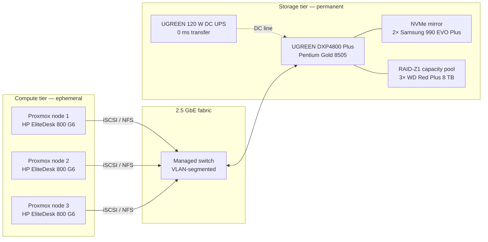
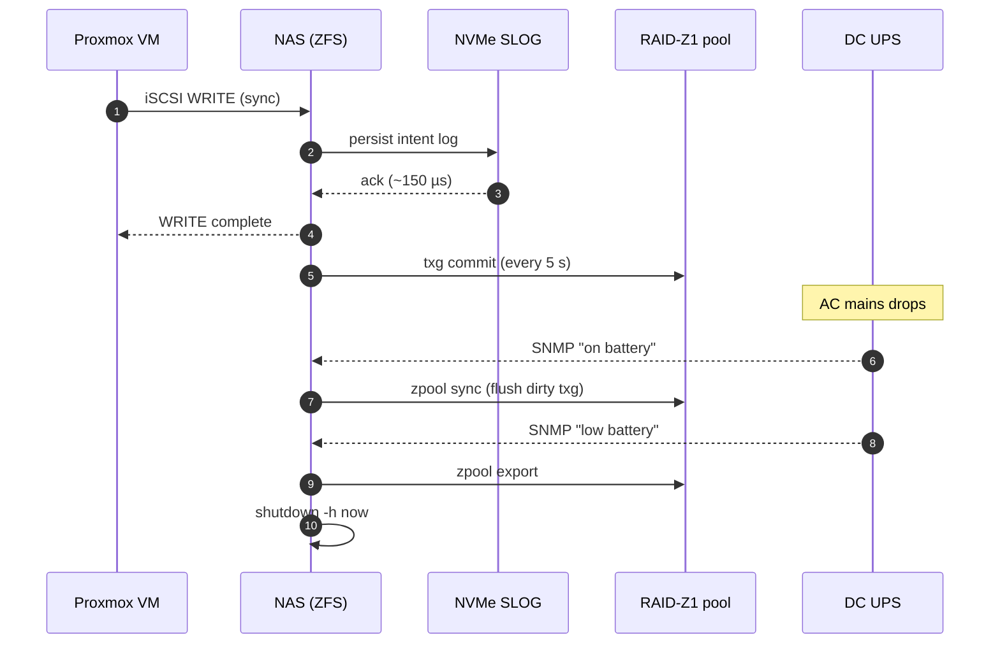

# Architecting the Foundation: Decoupling Storage at the Edge

Welcome to the first installment of my homelab architectural deep-dive. After a decade engineering observability pipelines and distributed systems at scale, I've reached a point where my own environment deserves the same rigor I'd demand from a production data center: deterministic state boundaries, GitOps-managed change, and hardware chosen for the workload rather than the price tag.

The deployment is undergoing a complete overhaul. The single, monolithic cluster I started with has aged into an anti-pattern; the new topology enforces strict separation of concerns across **network, storage, and compute**, all reconciled by FluxCD against a single source-of-truth repo. The compute layer is moving to a hyper-converged Proxmox cluster on HP EliteDesk 800 G6 mini-PCs — small, ephemeral, and trivially reimagable. The storage backend, by contrast, has the opposite life-cycle: it must be permanent, isolated, and engineered for resilience.

Phase 1 is therefore the storage tier. Before a single VM boots, we need a dedicated network-attached storage (NAS) appliance capable of feeding the Proxmox nodes over the wire without dragging brittle dependencies between the two layers.

## Decoupled by design

The contract is deliberately narrow: the only thing crossing the layer boundary is a block protocol (iSCSI for VM disks) or a file protocol (NFS for shared assets). Everything else — drive layout, encryption, snapshot policy, parity rebuild — stays inside the storage tier and never bleeds into Proxmox.

## The Edge Appliance: Compute for Storage

When evaluating the physical host for the array, raw bay count was the least interesting variable. The appliance had to balance three constraints that consumer NAS marketing usually ignores:

- **Idle power** under 25 W so it can sit on a UPS and run 24/7 without dominating the rack budget.
- **PCIe lane density** sufficient to feed two Gen 4 NVMe drives _and_ saturate a multi-gigabit uplink at the same time — most ARM-based NASes choke here because their SoC shares lanes between the M.2 slots and the network controller.
- **x86-64 with AES-NI and SSE 4.2** so ZFS checksumming, on-the-fly compression (LZ4/ZSTD), and at-rest encryption don't crater throughput.

The **UGREEN NASync DXP4800 Plus** lands in that intersection. The Intel Pentium Gold 8505 (one performance core + four efficient cores, hardware AES, hardware-accelerated SHA) gives ZFS enough headroom to checksum every block on the read path without becoming the bottleneck. The dual M.2 Gen 4 slots run on dedicated lanes, leaving the 2.5 GbE controller untouched. In practice the box is a single-purpose protocol translator: it speaks SATA and NVMe to the disks, then re-exports the result to Proxmox over NFS or iSCSI.

## The Capacity Tier: The CMR Mandate

Bulk storage handles the unglamorous workloads: long-term log aggregation from the Loki stack, nightly Restic backups of the Proxmox VMs, the media library, and Terraform state archives. These are mostly large sequential writes interleaved with the occasional resilver — exactly the pattern where the disk's recording technology matters more than the spindle speed printed on the label.

The capacity pool runs three **Western Digital Red Plus 8 TB** spinners (WD80EFZZ, NASware firmware, 5,640 RPM, 256 MB cache, three-year warranty). The critical attribute isn't capacity — it's the recording technology.

> [!WARNING] The SMR Trap
> The market is currently saturated with Shingled Magnetic Recording (SMR) drives, sold under nearly identical SKUs to their Conventional Magnetic Recording (CMR) cousins. SMR overlaps tracks like roof shingles to squeeze in extra density, but every random write triggers a read-modify-write cycle across an entire shingle band. Sustained writes collapse from ~150 MB/s to under 10 MB/s, and a parity rebuild on an SMR drive can take **a week** or fail outright as ZFS times out waiting for a sector. WD silently shipped SMR drives in the WD Red line in 2020 and the community is still cleaning up the fallout.

The Red **Plus** designation guarantees CMR. With three CMR drives in a **RAID-Z1** (single-parity) configuration I get 16 TB usable, single-disk fault tolerance, and predictable resilver times measured in hours rather than days. The 5,640 RPM spindle is a deliberate choice over 7,200 RPM: lower vibration in a four-bay chassis means the drives don't beat each other up, and idle power drops by roughly 2 W per disk — meaningful when the array sits powered for years.

## The Performance Tier: Engineering for IOPS

Bulk storage handles archives, but infrastructure-as-code workflows demand **IOPS at low queue depth**. When a Proxmox VM cold-boots, when Terraform reads a 200-line state file, when FluxCD reconciles a Helm release — every operation is a handful of small, latency-sensitive reads. Spinning rust with a ~9 ms seek time turns those operations into a wall-clock eternity.

The hot tier is two **Samsung 990 EVO Plus 1 TB** NVMe SSDs (PCIe Gen 4 ×4, ~7,150 MB/s sequential read, ~1 M IOPS at 4 K random read, with a Pablo controller and Samsung's V7 TLC NAND). Both drives populate the chassis's internal Gen 4 M.2 slots, configured as a **mirrored vdev** rather than a stripe — the workload is latency-sensitive, not throughput-sensitive, and a stripe doubles the blast radius of any single SSD failure.

The 1 TB pool is sized to hold every VM root disk plus the entire ZFS ARC's cold spillover. Two configurations are on the table for the next phase:

1. **L2ARC + SLOG topology** — present the NVMe mirror to ZFS as a read-cache + synchronous-write log in front of the spinning RAID-Z1. Lets the bulk pool inherit single-digit-millisecond effective latency for hot blocks while still using the spinners for capacity.
2. **Dedicated `ssd-pool`** — expose the mirror as its own pool, separate from `hdd-pool`, and let Proxmox storage classes decide which tier each VM disk lands on. Cleaner separation, simpler failure modes, but no transparent acceleration of the bulk pool.

I'll publish a follow-up benchmarking both topologies under realistic VM-boot and database-replay workloads before committing.

## Power Resiliency: Protecting In-Flight Data

A storage system is only as durable as its power delivery. A sudden outage during a write — particularly during a parity update on the RAID-Z1 — is the fastest route to filesystem corruption, and ZFS's copy-on-write model only protects you _if the dirty buffers actually reach the platter_.

Most homelabs solve this with a rack-level **AC UPS** that everything plugs into. Those work, but they introduce two compromises: a 4–8 ms switchover transient during the AC-DC inverter handover, and the dead-weight of running the NAS's internal AC adapter during the entire outage window — burning 10–15 % of the battery just on conversion losses.

The architecture instead places a **UGREEN 120 W DC UPS** directly inline on the NAS's 12 V barrel-jack input. The benefits stack up:

- **Zero-millisecond transfer.** The lithium-ion cell is electrically in parallel with the upstream brick; there is no inverter to engage, no relay to flip. The NAS never sees a voltage dip.
- **Conversion efficiency.** Battery and load are both DC; no AC↔DC round-trip, so the rated 120 W reservoir delivers closer to 95 % usable energy at the load.
- **Localized blast radius.** The NAS rides through brownouts independently of whatever else might be on the rack UPS — no shared depletion budget.

The next-phase work hooks the UPS up via NUT (Network UPS Tools) so the NAS receives the "low battery" SNMP trap and triggers a controlled `zpool sync` → `zpool export` → `shutdown -h now` sequence. The Proxmox nodes subscribe to the same NUT broker and shed VMs onto local NVMe before the storage tier vanishes.

## Write path under failure

The path above is what makes "decoupled storage" more than a buzzword. The VM never blocks on platter latency because the SLOG absorbs the synchronous write in microseconds. ZFS commits the actual data to the parity pool every five seconds in a single transaction group, and on power loss the SLOG replays any in-flight transactions on the next boot. The UPS gives the array enough runtime to finish the in-progress txg, export the pool cleanly, and power down — leaving disk state consistent rather than half-written.

## Hardware Specification Manifest

| Component        | Model                       | Role                  | Key Specification                           |
| ---------------- | --------------------------- | --------------------- | ------------------------------------------- |
| Chassis / CPU    | UGREEN NASync DXP4800 Plus  | Storage controller    | Intel Pentium Gold 8505, AES-NI, 8 GB DDR5  |
| Capacity disks   | 3× WD Red Plus 8 TB         | RAID-Z1 bulk pool     | CMR, 5,640 RPM, SATA 6 Gb/s, NASware        |
| Performance SSDs | 2× Samsung 990 EVO Plus 1TB | Mirrored hot tier     | NVMe Gen 4 ×4, 7,150 MB/s read, ~1 M IOPS   |
| Network          | Onboard 2.5 GbE             | Storage fabric uplink | Single-port, jumbo-frame capable            |
| Power protection | UGREEN 120 W DC UPS         | Inline battery backup | 0 ms transfer, DC-to-DC, NUT-compatible     |

## Moving Up the Stack

The physical foundation is now racked, cabled, and powered — state has been pulled out of the compute layer and isolated into a resilient, tiered hardware appliance.

The next post in the series moves up the stack to the software layer:

- **ZFS pool topology** — RAID-Z1 vs mirrored vdevs, ashift tuning for the WD Red's 4 K physical sector, recordsize per dataset, and the L2ARC vs separate-pool decision benchmarked head-to-head.
- **Network share configuration** — NFSv4 with Kerberos for shared assets, iSCSI multi-pathing for VM root disks, and the VLAN/jumbo-frame tuning to push 2.5 GbE to wire-rate.
- **Terraform & FluxCD integration** — declaratively defining datasets, share exports, snapshot retention policies, and Proxmox storage classes so the entire array is reproducible from a Git commit.

Stay tuned as we move from physical bits to logical bytes.
