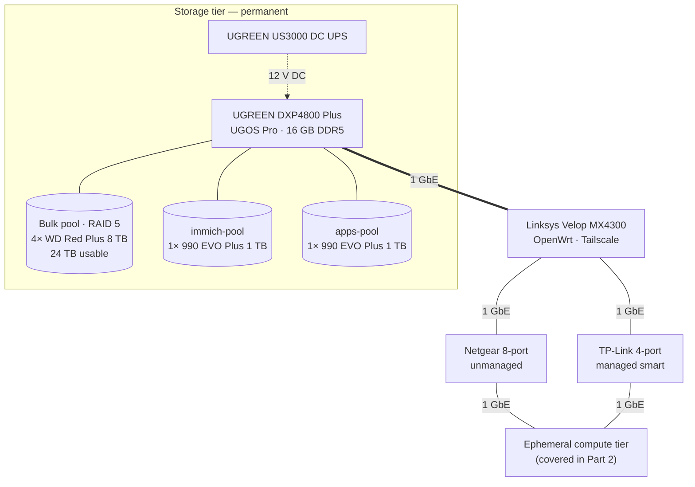
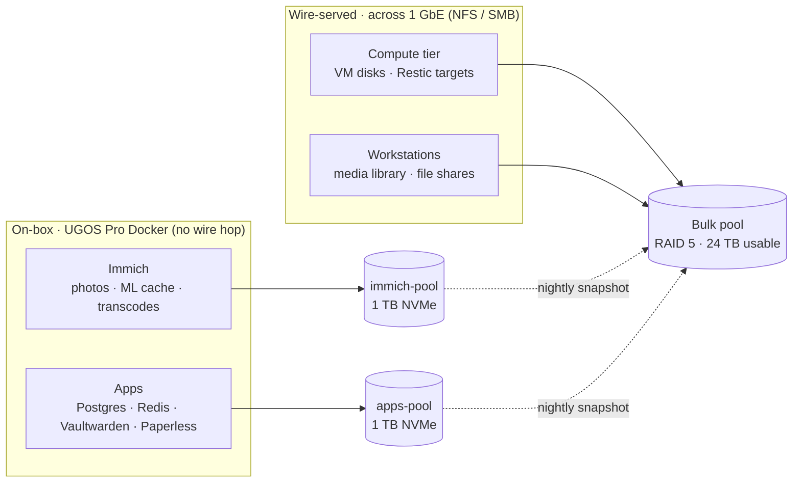

# Storage on Purpose: Building the NAS Tier of My Homelab

In a homelab, the machines should be replaceable. A host that won't boot can be reinstalled, a container stack can be rebuilt, a VM can be re-declared from scratch. Data is the opposite. Every photograph my family has ever taken, every Postgres row, every deduplicated backup chain has to outlive whatever happens above it. So the first piece of the rebuild isn't a hypervisor or an orchestrator — it's the layer that has to be there when everything else gets reimaged.

This is Part 1 of the homelab series, and it is deliberately storage-only: the appliance, the pools, the power path, and the contracts that make the rest of the lab boring in the best possible way. The compute hardware and scheduler get their own posts. None of it ships before the storage layer can stand on its own.

## The contract: storage is its own tier

The lab has a strict bisection between _the things that own state_ and _the things that consume it_. The NAS owns drives, parity, snapshots, share exports, and its own power. The ephemeral compute tier mounts shares, runs containers, and can be wiped at any time without taking a single byte with it. Across the boundary flows a file protocol (NFS or SMB) and nothing else.

The Linksys Velop MX4300 is the fabric edge — Wi-Fi, OpenWrt routing, Tailscale exit node, the gateway every wired link terminates on. The NAS is direct-wired to it at 1 GbE. Off the same Linksys, two parallel 1 GbE switches fan out: an 8-port unmanaged Netgear and a 4-port managed smart TP-Link, each carrying a different slice of the ephemeral compute tier. Everything downstream is 1 GbE today because that's what the switching fabric is, and I'd rather build around the real ceiling than market-copy past it. The single 1 Gbps wire out of the NAS is the bandwidth budget every wire-side consumer shares.

> [!TIP] Network ceiling, not chassis ceiling
> The DXP4800 Plus ships with a 10 GbE port _and_ a 2.5 GbE port on board — 12.5 Gbps of network hardware sitting on the rear panel with nowhere fast to terminate yet. The 1 GbE link in the diagram is set by the upstream Linksys, which has only gigabit ports. The fast NICs are latent headroom waiting for the day the fabric upgrades; the storage layout below should age into a faster switch, not need to be redesigned around one.

That ceiling shapes what each pool is _for_, which is the next thing to design.

## The edge appliance: a small box with the right lanes

When evaluating the chassis, raw bay count was the least interesting variable. Four bays gets you into the NAS conversation, but it does not tell you whether the box can be trusted as the stateful center of a lab. The appliance had to balance three constraints that consumer NAS marketing usually flattens into a spec sheet:

- **Low idle power** in the 25 W class so it can sit on a UPS and run 24/7 without dominating the rack budget.
- **PCIe lane density** sufficient to feed two Gen 4 NVMe drives off dedicated lanes — because the workloads that stress those drives are about to live on the box itself.
- **x86-64 with hardware AES and SHA**, so encrypted volumes, TLS, checksums, backups, and container workloads don't lean on a low-end ARM SoC for work modern silicon can dispatch in hardware.

The **UGREEN NASync DXP4800 Plus** lands in that intersection. The Intel Pentium Gold 8505 is more interesting than its quiet name suggests: a 12th-gen Alder Lake hybrid with one Golden Cove performance core, four Gracemont efficiency cores, six threads total, plus AES-NI and SHA acceleration. It was Intel's first hybrid-architecture Pentium and, as it turned out, one of its last — Intel retired the Pentium nameplate in 2023 after a thirty-year run, replacing it with the generic "Intel Processor" branding. This chip is the late-stage Pentium that finally caught up with modern silicon. It just didn't get to keep the name.

That CPU matters here because the box is doing more than serving files — it's also a Docker host. UGOS Pro, the Linux distribution UGREEN ships on the appliance, includes an app catalog and container tooling that can run services directly on the unit. Immich, Postgres, Vaultwarden, Paperless — all of them execute on this CPU, against the local NVMe pools, and never touch the 1 GbE wire on the way to disk. The NVMe lanes matter for _those_ workloads, not for "saturating the network."

The chassis is configured with **16 GB of DDR5** SO-DIMM (the unit accepts up to 64 GB). That's deliberately more than a basic file server needs: the Linux page cache will happily consume anything you give it, and Immich's machine-learning workers and the Postgres page cache make the difference visible.

UGOS Pro is **not ZFS**, and this design is not pretending otherwise. There's no copy-on-write, no SLOG, no L2ARC, no `zpool` vocabulary. Underneath, it's a fairly standard mdadm-style RAID with a Linux filesystem on top, plus a Docker stack and a web console wrapped around the lot. That's a deliberate trade-off I'm willing to make today: less operational ceremony, a competent app experience, and a vendor with a clear update cadence, in exchange for giving up some of ZFS's more sophisticated guarantees. If the calculus changes I have an exit — the chassis is x86, the drives are commodity SATA/NVMe, and TrueNAS Scale can own the hardware later — but I want to give UGOS Pro a real operational year before passing judgement.

## The capacity tier: RAID 5 over four CMR spinners

Bulk storage handles the unglamorous workloads: long-term archives, the media library, nightly Restic backups, and the snapshot landing zone for the two NVMe pools below. These are mostly large sequential writes interleaved with the occasional resilver — exactly the pattern where the disk's recording technology matters more than the spindle speed printed on the label.

The capacity pool runs four **Western Digital Red Plus 8 TB** spinners (`WD80EFPX`, NASware 3.0 firmware, 5,640 RPM, 256 MB cache, three-year warranty, 180 TB/year workload rating). The critical attribute isn't capacity — it's the recording technology.

> [!WARNING] The SMR Trap
> The market is saturated with Shingled Magnetic Recording (SMR) drives, sold under nearly identical SKUs to their Conventional Magnetic Recording (CMR) cousins. SMR overlaps tracks like roof shingles to squeeze in extra density, but every random write triggers a read-modify-write cycle across an entire shingle band. Sustained writes collapse from ~150 MB/s to under 10 MB/s, and a parity rebuild on an SMR drive can take **a week** or fail outright as the array times out waiting for a sector. WD's 2020 controversy centered on undisclosed SMR in the **2, 3, 4, and 6 TB EFAX Red models**; the Red Plus branding that followed became the practical buying signal for CMR. To spot an SMR drive in the wild, search the datasheet for "device-managed SMR" or check whether the spec sheet calls out CMR explicitly — if it doesn't answer the question, assume marketing is avoiding it.

The Red **Plus** designation is the buy signal: CMR platters, NASware firmware, and a workload rating meant for a small RAID box instead of a cold archive shelf. With four CMR drives in **RAID 5** I get 24 TB usable, single-disk fault tolerance, and rebuild times measured in hours rather than days. The 5,640 RPM spindle is a deliberate choice over 7,200 RPM: it gives up roughly 10 % of peak sequential throughput, but it shaves about 2 W per disk at idle, lowers vibration in a four-bay chassis (where each drive's resonance becomes its neighbour's seek-time penalty), and ends up saving ~8 W continuously across the array — a steady drain on the UPS budget that compounds quietly across years of uptime.

A note on RAID 5 vs RAID 6 at this scale. With four drives, RAID 5 yields 24 TB usable (75 % efficiency); RAID 6 would yield 16 TB (50 %) for the privilege of double-parity. RAID is not backup, and I am not asking parity to do backup's job — the pool still needs snapshots and off-box copies — but I did size it against my actual data on disk plus a generous five-year growth budget. Doubling parity overhead today would force me to grow the array prematurely. Rebuild windows on 8 TB CMR drives are short enough that single-parity is the right point on the curve _at four drives_. The math flips at six: at that capacity, RAID 6's protection during the long resync of a 50 TB-class array starts to earn its keep, and that's the threshold I'll watch when planning expansion.

## The performance tier: two pools, two workloads

Bulk storage handles archives, but the apps I actually use day-to-day — photos, password vaults, document indexes, anything backed by Postgres or Redis — need **IOPS at low queue depth**. Spinning rust with a ~9 ms seek time turns those operations into a wall-clock eternity. Two NVMe drives sit in the chassis's internal Gen 4 M.2 slots for exactly this workload.

Both drives are **Samsung 990 EVO Plus 1 TB** SSDs (PCIe Gen 4 ×4 / Gen 5 ×2, NVMe 2.0, ~7,150 MB/s sequential read, ~850 K IOPS random read, ~1.35 M IOPS random write, V8 TLC NAND — Samsung's 8th-generation 236-layer V-NAND). On paper those numbers are absurd next to a gigabit uplink; in this design, that is exactly the point. What's unusual is the topology: I'm running them as **two independent single-drive pools** rather than a mirror, a stripe, or an L2ARC/SLOG pair in front of the bulk array.

The reasoning is workload-driven. The two pools host _unrelated_ services:

- **`immich-pool`** holds the Immich photo library — the original RAW/JPEG archive, the resized previews, the ML thumbnail cache, the transcoded videos. Read-heavy, large object sizes, all of it driven by one specific Docker container.
- **`apps-pool`** holds everything else app-shaped — the Postgres and Redis data directories, the Vaultwarden / Paperless / Linkding volume trees, configuration, working caches. Mixed read/write, small object sizes, lots of independent services that I don't want sharing a noisy neighbour with the photo library.

Mirroring across the two pools would cost half my flash capacity to defend against a failure mode I already address differently. Both pools snapshot nightly into the bulk RAID 5, so the worst-case loss of either SSD is one day of changes — and I get to keep the other 1 TB for actual data instead of redundancy.

The architectural payoff is bigger than the disk math, though. Both of these pools host **UGOS Pro Docker apps that run on the appliance itself**. Immich indexes the photo library at SSD speed; Postgres talks to its data directory inside the local Docker bridge. Neither workload traverses the 1 GbE uplink — the wire only carries the user-facing HTTP request and response, which are bytes-per-request, not bytes-per-second-per-file. The flash tier is, deliberately, a _local_ resource for the box's own services. That's why the network ceiling in the topology section bounds the bulk pool but not these two.

## Where the data lives

Two paths into storage, three pools serving them. Anything coming over the wire — VM disks, Restic targets, shared media — lands on the bulk RAID 5. Anything running inside the appliance's own Docker stack reads and writes directly to the pool that hosts it. Nightly snapshot replication from both SSD pools onto the bulk pool ties the two domains together: the spinning array is the durable system of record for everything the SSDs produce.

## Power: one brick, no inverter

A storage system is only as durable as its power delivery. A sudden outage during a write — particularly during a parity update on the RAID 5 — is the fastest route to filesystem corruption, and no amount of integrity checking helps if the dirty buffers never reach the platter.

Most homelabs solve this with a rack-level **AC UPS** that everything plugs into. Those work, but they introduce two compromises: a 4–8 ms switchover transient during the AC-DC inverter handover, and the dead-weight of running the NAS's internal AC adapter during the entire outage window — burning 10–15 % of the battery on conversion losses.

The architecture instead places a **UGREEN US3000** — a 120 W DC UPS — directly inline on the NAS's 12 V barrel-jack input. The US3000 packs **43.2 Wh / 12,000 mAh** into a four-cell lithium-ion pack (roughly a ten-minute class runtime for this kind of NAS load), and the inline DC topology keeps the outage path short. It also speaks to UGOS Pro over a USB-C data link, which is what makes the NUT integration possible without a serial cable hanging off the back of the rack. The benefits stack up:

- **Zero-millisecond transfer.** The lithium-ion cell sits electrically in parallel with the upstream brick; there is no inverter to engage, no relay to flip. The NAS never sees a voltage dip.
- **Conversion efficiency.** Battery and load are both DC; no AC↔DC round-trip, so less of the small battery is spent warming up conversion stages.
- **Localized blast radius.** The NAS rides through brownouts independently of whatever else might be on the rack UPS — no shared depletion budget.

The UPS speaks USB; the next-phase work hooks it into UGOS Pro's NUT (Network UPS Tools) integration, so the appliance receives the "low battery" signal and runs a controlled shutdown in this order:

- UGOS Pro receives the **on-battery** event from NUT and starts a countdown.
- Docker apps on both SSD pools quiesce — Postgres checkpoints, Immich finishes the in-flight worker job — and stop in dependency order.
- The volumes are unmounted cleanly so no write buffers are left in flight, and the RAID 5 array is stopped.
- `shutdown -h now` takes the appliance down with seconds to spare on the battery.

Once that runs, the wire-side compute tier subscribes to the same NUT broker and sheds workloads onto local storage before the share endpoints disappear.

## Hardware specification manifest

| Component        | Model                        | Role                  | Key specification                                              |
| ---------------- | ---------------------------- | --------------------- | -------------------------------------------------------------- |
| Chassis / CPU    | UGREEN NASync DXP4800 Plus   | Storage controller    | Pentium Gold 8505 hybrid (1P + 4E / 6T), AES-NI, 16 GB DDR5    |
| Storage OS       | UGOS Pro                     | NAS distribution      | mdadm-style RAID, app catalog, and container tooling           |
| Capacity disks   | 4× WD Red Plus 8 TB          | Bulk pool             | `WD80EFPX`, RAID 5, 24 TB usable, CMR, 5,640 RPM, 256 MB cache |
| Performance SSDs | 2× Samsung 990 EVO Plus 1 TB | Two single-disk pools | PCIe Gen 4 ×4, V8 NAND, `immich-pool` and `apps-pool`          |
| Power protection | UGREEN US3000 120 W DC UPS   | Inline battery backup | 0 ms transfer, 43.2 Wh / 12,000 mAh, 12 V DC, NUT-compatible   |
| Storage uplink   | Onboard Ethernet             | NAS ↔ gateway         | 1 GbE active (chassis carries 1× 10 GbE + 1× 2.5 GbE headroom) |
| Compute fabric A | Netgear 8-port unmanaged     | 1 GbE switch          | Trunk to ephemeral compute tier (Part 2)                       |
| Compute fabric B | TP-Link 4-port managed smart | 1 GbE switch          | Trunk to ephemeral compute tier (Part 2)                       |
| Gateway          | Linksys Velop MX4300         | Routing + Tailscale   | OpenWrt firmware, 1 GbE LAN, Tailscale exit node               |

## Moving up the stack

The physical foundation is racked, cabled, and powered — three pools, one UPS, one wire to the gateway. The next posts in the series stay inside the storage tier before the compute story begins:

- **Share design.** NFS for VM disks and Restic targets, SMB for workstation/media access, with the export layout and per-share snapshot cadence tuned per workload.
- **Snapshot policy.** Retention curves for both NVMe pools onto the bulk RAID 5, plus how the pools recover from a corrupted SSD without losing more than a day.
- **Immich on a dedicated pool.** How `immich-pool` is provisioned in UGOS Pro, how the Docker stack gets the local volume, and what nightly snapshot retention to the bulk pool actually looks like.
- **NUT broker integration.** Wiring the US3000 into UGOS Pro's NUT, then exposing it as a network broker so the wire-side compute tier can shed workloads in the same outage.

The compute deep-dive — the hypervisors, the Pi cluster, the eventual declarative pipeline — gets its own series, beginning with **Part 2**. None of it ships before the storage layer can stand on its own.

Stay tuned as we move from physical bits to logical bytes.
