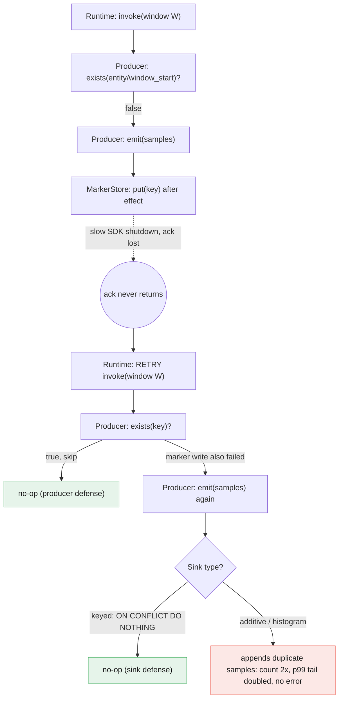

# Idempotency is the producer's job

For about three weeks a p99 latency panel read roughly 8% high. The p99 is the 99th percentile, the value that only the slowest 1% of requests exceed; latency dashboards lean on it because it captures the bad tail your average hides. This one was not spiking, not flatlining, just consistently and plausibly elevated, in the range where you start asking whether a dependency got slower or a garbage-collection tuning change regressed. We spent a half-day I want back bisecting deploys, walking backward through recent releases to find the one that broke things, before someone noticed the sample _count_ on that distribution was also high, by about the same margin. The percentiles weren't measuring a slow system. They were measuring the same windows twice.

The duplicates came from a publisher, the small piece of code that takes a finished batch of measurements and ships them off to be stored. It is invoked asynchronously once per completed window, retried by the platform that runs it, and it writes into a histogram, a metric that simply appends every sample it receives onto a growing list. That platform, the thing that actually runs your code on demand, is AWS Lambda in our case, where short-lived functions spin up to handle one event and then vanish. Nothing was broken. Everything was at-least-once, meaning the platform promises to deliver each event one or more times but never guarantees exactly one, working as designed, and lying to us in a way no alert was shaped to catch.

## A metric that was wrong but never broken

The reason this survived three weeks is that it never tripped a threshold. A doubled count metric, the kind that just tallies how many events occurred, looks like more traffic, which nobody questions. A 30% percentile blowout pages someone. An 8% one reads as drift, the kind of number you rationalize, attribute to a noisy neighbor (another tenant sharing the same hardware and stealing cycles), and park on a "look at it next sprint" list.

The mechanism was a replay. The publisher ran, emitted its samples, then hit a slow SDK shutdown, where the client library that talks to the metrics backend took too long to flush and close, and got retried. The second run re-emitted the same window. Because the sink, the storage system on the receiving end, appended rather than deduped, every sample landed twice, and p99 shifted toward the tail it now had two copies of.

What makes this class of failure dangerous is precisely that it sits just under your alert thresholds. A system that fails loudly gets fixed within the hour. One that is quietly, defensibly wrong erodes trust in every number it hands you, and it does it slowly enough that you blame yourself first.

## At-least-once is the floor, not a degraded mode

The instinct is to call this a bug in the runtime, the platform running your function. It isn't. "Exactly once" is mostly a myth at the transport layer, the network plumbing that moves a message from sender to receiver; you are handed at-least-once and you build idempotency on top of it. Idempotency just means an operation can run twice and leave the system in the same state as running it once, so a duplicate does no harm. The hedge in "mostly" is doing real work, though. Kafka, the distributed log many systems use as a message backbone, genuinely implements [exactly-once semantics](https://www.confluent.io/blog/exactly-once-semantics-are-possible-heres-how-apache-kafka-does-it/) using producer sequence numbers (each message carries a counter the sender stamps on it) and broker-side dedup (the server drops a message whose number it has already seen). That is the whole point: it works because the producer supplies the key the broker dedupes on. Strip that key away and you are back to the [impossibility results](https://bravenewgeek.com/you-cannot-have-exactly-once-delivery/) that make naive exactly-once a fantasy.

Once I started looking, the duplicate sources were everywhere I'd already deployed against:

- **Async-invoke retries.** The platform, not your function, decides what "failed" means. A successful side effect followed by a connection close or network timeout flips the whole invocation to failed, and it retries. [Lambda will retry a failed asynchronous invocation up to two more times](https://docs.aws.amazon.com/lambda/latest/dg/invocation-retries.html) and warns you outright that your code may see the same event again. Your function already did the work; the platform has no way to know that.
- **At-least-once queues.** Here the duplicates come from a message queue, a buffer that holds work until a consumer picks it up. A visibility timeout (a message hidden from other consumers for a set window) reappears if not acknowledged in time; add in-flight redelivery and consumers that crash after handling but before the ack, the acknowledgment that tells the queue the work is done. [SQS standard queues](https://docs.aws.amazon.com/AWSSimpleQueueService/latest/SQSDeveloperGuide/standard-queues.html), Amazon's basic queue service, say it plainly: at-least-once delivery, and more than one copy of a message might arrive.
- **Webhook redelivery.** A webhook is an HTTP callback one service fires at another when something happens. The sender retries until it sees a 2xx, the HTTP status range that means success. A slow response means it sends again even though you processed the first.
- **Client retries.** The most boring one. A timeout on the caller's side for a request the server actually completed.

Every one of these has the same shape. The effect happened, the acknowledgment didn't make it back, so the work runs again. No configuration flag removes this. You can lower retry counts and tighten timeouts, but the probability never reaches zero, and designing as though it does is how you get the metric above. Treat duplicate delivery as a guaranteed input. If your correctness depends on something running once, what you actually have is a latent incident.

## Additive sinks versus deduped sinks

What turned a routine retry into weeks of wrong data was the sink. This is the asymmetry worth internalizing, because the two kinds of sink fail in opposite directions.

Some sinks collapse duplicates for you. Take a Prometheus-style time series, a metric stored as a stream of points each stamped with a name, a timestamp, and a set of tags. Send the same point twice for the same second and it overwrites the slot: last write wins, and the replay vanishes. That free pass is exactly why people generalize "the sink will handle it." They have only ever tested against a sink that happened to dedupe.

Be careful generalizing from that, though, because plenty of sinks don't. [Datadog distribution metrics](https://docs.datadoghq.com/metrics/distributions/) are the sharpest version of the problem. A distribution metric, unlike a plain count, keeps the full spread of individual measurements so it can compute percentiles like p99 later. Datadog keeps every sample you send as raw, unaggregated sketch data, with no key to collapse on, because every sample is a distinct observation by design. A replayed batch double-counts every sample and corrupts the percentiles, and it does so with no error at all, because appending is the correct behavior for that data type. The same logic covers append-only tables, event logs, and ledger rows. The property that makes them valuable, every entry being real and ordered, is the property that leaves them defenseless against a replay.

Here is the divergence on one window of latency samples:

```text
window W emitted once   ->  [12ms, 40ms, 800ms]            count 3,  p99 ~ 800ms
window W emitted twice  ->  [12, 40, 800, 12, 40, 800]     count 6,  p99 ~ 800ms by value
                                                           but the tail mass doubled and
                                                           every rate/percentile computed
                                                           downstream now drifts
```

So before you reason about delivery, classify your sink. A deduping sink hides your duplicates and lets a bad assumption live for months. An additive sink amplifies them on the first replay. The append-only stores you reach for because they never lose data are the same ones with no native defense against being told the same thing twice.

Here is where each defense intervenes, and why the additive branch has no fallback. The diagram traces one window, W, from the runtime's first invoke through a lost acknowledgment, a retry, and the two places a duplicate can still be stopped:



## The producer-side marker: check and skip

The fix is unglamorous and lives entirely on the producer, the sender, the one party that knows it is sending. After a unit of work succeeds, write a small marker, a tiny record that says "this specific job is done," keyed by that unit. At the start of every attempt, check for the marker and skip if it's there.

The unit of work has to be something both attempts compute the same way. For a per-window publisher, that's the entity and the window boundary, not a UUID and not a timestamp generated at runtime, because the retry has to derive the same key the original did. A fresh random ID would differ on each attempt and defeat the whole check.

```python
key = f"{entity}/{window_start}"      # identical across retries

if marker_store.exists(key):          # one extra read
    return                            # already emitted this window

emit(samples)                         # the effect
marker_store.put(key, ttl=retention)  # one extra write
```

The `ttl` there is a time-to-live, an expiry the store attaches to the marker so old keys clean themselves up instead of accumulating forever. One read and one write buys you idempotency at the producer. There is a real ordering subtlety. Write the marker before the emit, then crash, and you have permanently suppressed a window that never landed. I would rather risk a rare double-emit than a silent drop, so the marker goes _after_ the effect. That leaves the gap between emit and marker still replayable, which the sink-side key in the next section closes.

It's worth naming where this departs from the textbook. The [Amazon Builders' Library guidance on idempotent APIs](https://aws.amazon.com/builders-library/making-retries-safe-with-idempotent-APIs/) recommends recording the idempotency token and the mutation in a single atomic operation, one indivisible write that either fully happens or doesn't, so there is no window at all. I'm deliberately splitting them and accepting a small replay window, because an additive sink with its own key can absorb a rare double-emit, whereas a dropped window is gone for good. Pick the failure you can tolerate and order the writes to favor it. The cost either way is a rounding error: one extra round-trip per unit of work, against hours of debugging corrupted aggregates after the fact.

## The idempotency key at the sink: the other half

The marker handles the case where the same producer instance retries. It does nothing if two producers race, both running the same window at once, or if the marker write was itself the thing that failed. The other half is an idempotency key carried into the sink: a unique constraint (a rule that forbids two rows with the same key), a conditional insert, a write that no-ops on conflict, meaning it quietly does nothing when the row already exists.

```sql
insert into window_emissions (entity, window_start, ...)
values (...)
on conflict (entity, window_start) do nothing;
```

This is the same pattern Stripe exposes through [client-supplied idempotency keys](https://docs.stripe.com/api/idempotent_requests): the caller generates a key tied to the identity of the work, and the server uses it to recognize a retry as a retry, so charging a card twice on a network hiccup becomes a no-op. It works wherever the sink has a key to enforce, whether that's Postgres, a keyed object store like S3 where the object name is the key, or anything with a uniqueness guarantee. It does not work for distributions and append-only logs, which have no notion of "the same row." For those, the producer-side marker isn't a nicety; it's the only line of defense, because the sink fundamentally cannot tell a legitimate re-emit from a duplicate. It was never given a key to make that call.

That's the real case against "just let the sink dedupe." The sink can only dedupe what the producer chose to make dedupable. A duplicate and a deliberate re-emit are byte-identical from where the sink sits. The one system that knows which is which is the one doing the sending, so that is where the key has to be born.

At-least-once is the floor you build on. Additive sinks turn a replay into silent corruption rather than a loud error. And the only party that can tell a replay from a real event is the one replaying it. Put idempotency at the point of replay. Anywhere else, you are asking some downstream system to read your mind.
