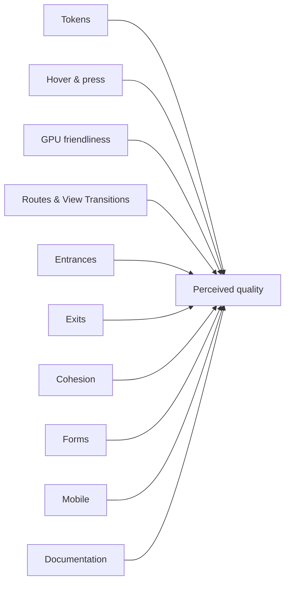
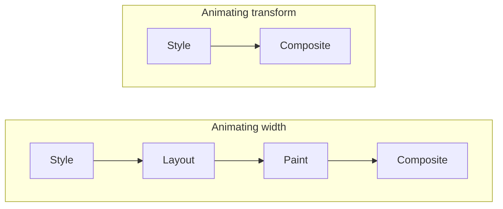
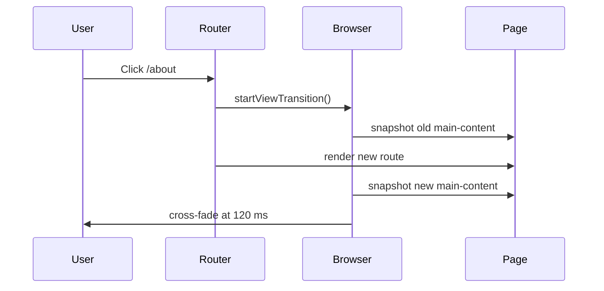

# Motion you can feel: notes from a 25-finding audit

Every animation is a promise. A 250-millisecond ease-out tells a user "this is responding to you" — but if the same cursor twitches under two competing duration tokens, blinks at three different cadences, and stalls the main thread on a `width` transition, the promise turns into static. Motion that doesn't feel **considered** quietly drains every other quality of the interface.

I spent a week auditing every animation, transition, and micro-interaction across this Angular 21 portfolio with that lens, and the gap between what I thought I shipped and what I actually shipped was bigger than I expected. The artefacts were the usual suspects: a hardcoded `0.3s ease-out` in one component because I forgot we had a token; an inert `--transition-medium` referenced from three places that had never been declared; a sidebar collapse that animated `width` and re-laid out the whole subtree on every frame.

This post distils the result: a **25-finding audit** broken into nine implementation phases, **38 files touched**, and a small handful of architectural moves that did the heavy lifting. The numbers tell one story (P1 = 7, P2 = 9, P3 = 9), but the more interesting story is the principles that fall out of taking motion seriously as a system.

## The lens

I started by writing the audit before writing the code, mirroring an earlier rendering audit I did for the same app. Findings were grouped along ten dimensions, severity-tagged P0 → P3, and walked top-down so foundations landed before polish.



| Severity | Count | Examples                                                                                                           |
| -------- | ----- | ------------------------------------------------------------------------------------------------------------------ |
| **P0**   | 0     | —                                                                                                                  |
| **P1**   | 7     | Token duplication, undefined `--transition-medium`, sidebar `width` animation, missing reduced-motion contract     |
| **P2**   | 9     | Inconsistent `:active` states, route-fade choreography, command palette discrete transitions, toast exit animation |
| **P3**   | 9     | Cursor blink unification, sliding tab indicator, cohesion details, doc comments                                    |

Catching that nothing was P0 was its own win — the system wasn't broken, it was **incoherent**. That's a friendlier problem to solve than a regression.

## A six-token motion ladder

The single highest-leverage change was the foundation: collapse three loosely-defined transition tokens into a system that separates **duration** from **easing** and re-composes them as named shorthands.

```css
:root {
  --duration-fast: 150ms;
  --duration-base: 250ms;
  --duration-slow: 400ms;
  --duration-tab: 120ms;

  --ease-standard: cubic-bezier(0.2, 0, 0, 1);
  --ease-decelerate: cubic-bezier(0.05, 0.7, 0.1, 1);
  --ease-accelerate: cubic-bezier(0.3, 0, 0.8, 0.15);

  --transition-fast: var(--duration-fast) var(--ease-standard);
  --transition-base: var(--duration-base) var(--ease-standard);
  --transition-slow: var(--duration-slow) var(--ease-standard);
  --transition-enter-base: var(--duration-base) var(--ease-decelerate);
  --transition-exit-base: var(--duration-base) var(--ease-accelerate);
  --transition-tab: var(--duration-tab) var(--ease-standard);
}
```

The durations match Material 3's `short3` / `medium1` / `medium4` tokens, so the cadence reads as familiar even before you name it. The three easing curves come straight from M3's standard / emphasized-decelerate / emphasized-accelerate spec — symmetric for in-place state changes, slow-out for entering elements, fast-out for leaving ones. The composed shorthands let call sites stay one token wide (`transition: opacity var(--transition-enter-base);`) while the system retunes from a single source.

`--transition-fast` / `base` / `slow` keep their historical names so existing call sites don't have to churn. `--duration-tab` is a deliberate editor-style override — the active-tab indicator and the cross-route main-content fade both run at 120 ms so navigation feels closer to a code editor than a marketing site (no float-in, no `translateY` drift).

## `transform: scaleX` over `width`: the GPU lesson

The next finding was the most transferable: any animation that changes a layout-dirty property pays for layout, paint, _and_ composite on every frame. Compositor-only properties (`transform`, `opacity`, `clip-path`, `filter`) skip the first two stages entirely.



The sidebar collapse used to animate `width` from 260 px to 60 px, dragging the entire nav-list, the avatar, the divider labels, and the footer through layout sixty times a second. The refactor pins the host at a fixed pixel width and shrinks the visible rail via a `transform: scaleX` from the left edge. Direct children counter-scale so their content keeps its true geometry:

```css
:host {
  --sidebar-scale: 1;
  width: var(--sidebar-width);
  transform-origin: left center;
  transform: scaleX(var(--sidebar-scale));
  transition: transform var(--transition-base);
  will-change: transform;
  contain: layout style;
}

:host(.collapsed) {
  --sidebar-scale: calc(var(--sidebar-collapsed) / var(--sidebar-width));
}

.sidebar-header,
.nav-list,
.sidebar-footer {
  transform: scaleX(calc(1 / var(--sidebar-scale)));
  transition: transform var(--transition-base);
}
```

The `--sidebar-scale` ratio carries the math so children can derive their inverse without re-computing it. `contain: layout style` walls the subtree off so any residual reflow stays inside the sidebar. The same pattern shipped to the skill-progress bar — `[style.--badge-fill-scale]` driving a `transform: scaleX` instead of animating the `width` of the fill element.

The lesson generalises: **prefer transforms for any animation a user sees more than once a session.** The pulse on the hero glow orbs runs every eight seconds for as long as the page is open; the sidebar opens and closes constantly. Both deserve the compositor.

## View Transitions for routes and theme

Angular 21 ships a first-party integration with the View Transitions API via `withViewTransitions()`, and once it's enabled every route swap can be choreographed with a single CSS rule pair. The same primitive — `document.startViewTransition()` — wraps the theme toggle so light/dark swaps cross-fade the entire viewport instead of snapping.



The router-level integration is one config call; the theme-level integration is a six-line guard that respects reduced-motion and feature-detects the API:

```typescript
toggle(): void {
  const next: Theme = this.isDark() ? 'light' : 'dark';
  const supportsViewTransition =
    this.isBrowser &&
    'startViewTransition' in this.document &&
    typeof (this.document as Document & { startViewTransition?: unknown })
      .startViewTransition === 'function';
  const prefersReducedMotion =
    this.isBrowser &&
    window.matchMedia('(prefers-reduced-motion: reduce)').matches;

  if (supportsViewTransition && !prefersReducedMotion) {
    (this.document as Document & { startViewTransition: (cb: () => void) => unknown })
      .startViewTransition(() => this.theme.set(next));
  } else {
    this.theme.set(next);
  }
}
```

Once the snapshot pair exists, you style it like any other animation — but the timing matters. The default browser fade lands around 250 ms, which feels marketing-leisurely on a tabbed-navigation site. The route fade was retuned to opacity-only at the new `--duration-tab` (120 ms) so navigation between editor-style tabs feels tight:

```css
::view-transition-old(main-content) {
  animation: simple-fade-out var(--transition-tab) both;
}
::view-transition-new(main-content) {
  animation: simple-fade-in var(--transition-tab) both;
}
```

The sidebar and tab bar each carry their own `view-transition-name` so they morph in place via the browser's auto-handling — no JS, no measurement, just a CSS contract.

## Reduced-motion is a contract

Every motion choice above is filtered through one rule: motion-sensitive users shouldn't have to opt out one component at a time. WCAG 2.3.3 (Animation from Interactions) only requires a path to disable, but the right primitive is a global one — a single rule that collapses every animation and transition to a near-zero duration:

```css
@media (prefers-reduced-motion: reduce) {
  *,
  *::before,
  *::after {
    animation-duration: 0.01ms !important;
    animation-iteration-count: 1 !important;
    transition-duration: 0.01ms !important;
    scroll-behavior: auto !important;
  }
}
```

That covers 95 % of cases, but a handful of animations land on intermediate shapes — the hero typewriter starts at `width: 0`, the name reveal starts at `clip-path: inset(0 100% 0 0)`, the title caret starts at `opacity: 0`. Collapsing those animations to zero duration would briefly flash the wrong state. The fix is a per-component override that forces the **final** state explicitly:

```css
@media (prefers-reduced-motion: reduce) {
  .hero-greeting-text {
    width: auto;
    animation: none;
  }
  .hero-name {
    clip-path: none;
    opacity: 1;
    animation: none;
  }
  .hero-title-caret {
    opacity: 1;
    animation: none;
  }
}
```

The contract is enforceable. A Playwright spec navigates the home route under emulated reduced motion, walks every element, and fails if any has a computed `transition-duration` or `animation-duration` over 5 ms. That single test catches token regressions, third-party CSS slipping in, and the every-six-month "I'll just hardcode this one" bug.

## The hero boot sequence

The most recent layer of polish is a layered boot sequence on the hero route. Every line animates in once on first paint, choreographed like a code editor opening a file:

```mermaid
gantt
  title Hero boot sequence (ms)
  dateFormat SSS
  axisFormat %L
  section Greeting
  Typewriter            :a1, 000, 1100ms
  section Name
  Clip-path reveal      :a2, 350, 700ms
  section Title
  Fade up               :a3, 700, 350ms
  Caret blink starts    :milestone, 1500, 0
  section Body
  Summary fade up       :a4, 1100, 350ms
  Highlight shimmer     :a5, 1300, 900ms
  Actions fade up       :a6, 1300, 350ms
  Social fade up        :a7, 1500, 350ms
```



The greeting (`>_ Hello, I'm`) types in via a `steps(10)` animation on `width`. The hero name reveals left-to-right via a `clip-path: inset(0 100% 0 0)` wipe — a deliberate choice over a per-letter cascade, because wrapping each glyph in an `inline-block` span would re-sample the parent's diagonal `linear-gradient(135deg, …)` per letter and break the smooth gradient sweep. `clip-path` preserves the gradient because it's a single mask on a single element. The terminal caret after the title stacks two animations: a delayed fade-in lands the caret after the title text, then the shared `cursor-blink` keyframe takes over for the steady-state blink.

The ambient layer is pointer-driven. A single rAF-batched listener writes two CSS custom properties on the host element; CSS reads them for both an orb parallax and a follow-the-cursor accent spotlight:

```typescript
afterNextRender(() => {
  if (!isPlatformBrowser(this.platformId)) return;
  if (!window.matchMedia('(pointer: fine)').matches) return;
  if (window.matchMedia('(prefers-reduced-motion: reduce)').matches) return;

  const host = this.host.nativeElement as HTMLElement;
  let raf = 0;
  const onPointerMove = (e: PointerEvent) => {
    const x = e.clientX / window.innerWidth;
    const y = e.clientY / window.innerHeight;
    if (raf) return;
    raf = requestAnimationFrame(() => {
      raf = 0;
      host.style.setProperty('--pointer-x', x.toFixed(3));
      host.style.setProperty('--pointer-y', y.toFixed(3));
      host.dataset['pointerActive'] = 'true';
    });
  };
  window.addEventListener('pointermove', onPointerMove, { passive: true });
  this.destroyRef.onDestroy(() => {
    window.removeEventListener('pointermove', onPointerMove);
    if (raf) cancelAnimationFrame(raf);
  });
});
```

Three guards keep the effect honest: it only attaches in `afterNextRender` on the browser platform, it skips coarse pointers (touch users gain nothing), and it skips reduced-motion. The opacity of the spotlight gates on `[data-pointer-active='true']` so SSR / touch / reduced-motion users never see a pinned center glow they can't influence.

## Lessons

- Animate `transform`, `opacity`, `clip-path` — almost never `width`, `height`, `top`, `left`. The compositor wants two properties; layout wants seven. Write to the right one.
- One token system feeds everything. Three durations and three easings is enough for an entire site, provided the easings are deliberately chosen and the durations climb on a recognisable ladder.
- `prefers-reduced-motion` isn't a feature — it's a contract you write a test for. A global rule plus a handful of explicit final-state overrides plus one Playwright assertion gets you there.
- Modern CSS replaces most JS animation libs. View Transitions, `@starting-style`, `transition-behavior: allow-discrete`, scroll-driven animations, and `clip-path` cover almost every interaction this app needs without a single `animate()` call.
- Audit your own work. The findings I expected (the hardcoded duration, the missing token) were already documented in my own head; the ones that taught me the most were the ones I'd rationalised away.

---

_Have thoughts on motion or want to compare notes? [Get in touch](/contact)._
