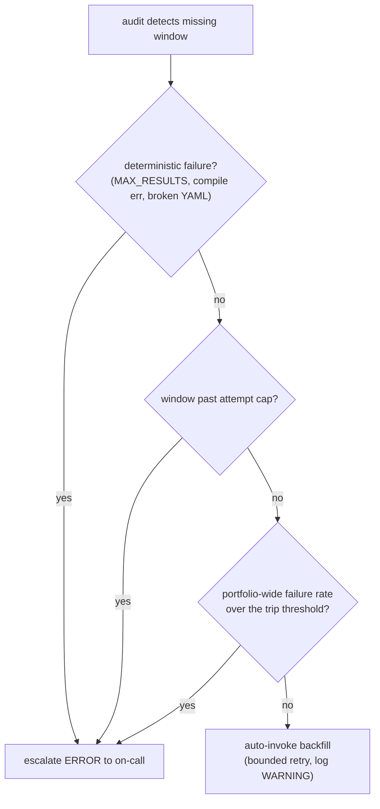
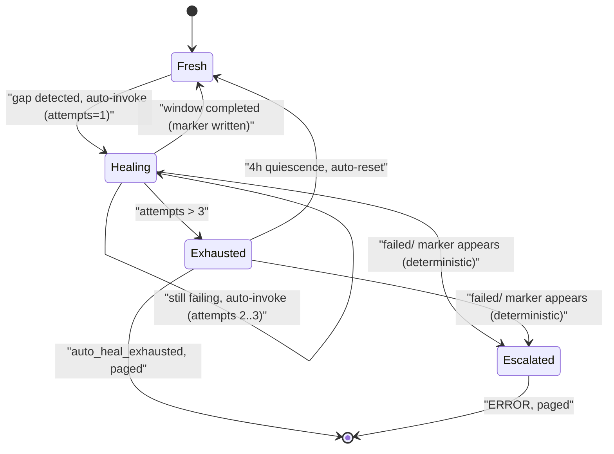

# Self-healing isn't a default

The audit Lambda in the pipeline I've been writing about runs every fifteen minutes. AWS Lambda functions are the small stateless workers that spin up to handle a single event and then vanish, and this particular one has a narrow job. It enumerates every scheduled tick that should have produced an aggregated window of data over the last few hours (a window is just one of those fixed time-slices the pipeline rolls up), diffs that set against the `completed/` markers actually present in S3, and emits a structured ERROR log for every gap it finds. A `completed/` marker is a small file the pipeline writes to mark a window as done, and S3 is Amazon's object storage, the place those files live. The engineer on call gets the alert, runs an `aws lambda invoke` command from a runbook (the step-by-step doc that tells you what to type), and a second function, the backfill Lambda, picks up the missed window, replays it, writes the marker, and closes the gap.

Looking at that flow, the obvious question is: _why isn't the audit Lambda just calling the backfill Lambda directly?_ The audit knows the asset, the window, and the remediation command. The backfill function is right there. We could skip the page, skip the runbook, and let the system heal itself.

I almost shipped that design. What stopped me was sitting down and writing out the failure modes the audit would actually be reacting to.

## The seductive default

Auto-recovery is the default the cloud-vendor blog posts sell you, and they're not entirely wrong. Most gaps in this pipeline are transient, meaning they clear up on their own without anyone touching them. A 5xx (the family of HTTP status codes a server returns when _it_ broke, not you) from Coralogix, our log backend. A missed fire from EventBridge, the AWS scheduler that's supposed to kick the job off on a clock. A Lambda cold start, the extra startup delay you pay when a worker spins up from scratch rather than reusing a warm one, eating the first fifteen seconds of the minute. An async invoke (a fire-and-forget call where the caller doesn't wait for a result) that retried twice and got shunted to a DLQ, the dead-letter queue where AWS parks events it has given up on, even though the work actually succeeded. That last one is a documented Lambda behavior, not a hypothetical: asynchronous invocations [retry function errors twice and can route the event to a dead-letter queue](https://docs.aws.amazon.com/lambda/latest/dg/invocation-retries.html), so a window can show up as failed even though the work landed. Each of these recovers cleanly on the next attempt. Auto-heal on those failure modes pays for itself instantly: the page never fires, the gap closes, on-call sleeps through it.

The natural design follows from there. Detect a gap, invoke backfill, log the recovery. Done. The shape is the detect-diff-act control loop that Kubernetes controllers run, the loop a container orchestrator runs constantly to compare the world it sees against the world you asked for and nudge the difference toward zero. That resemblance was enough to make the design feel familiar for the first few weeks of building. The resemblance is real, but it cuts the other way once you look closely. Those controllers don't reconcile in a tight unbounded loop. They rate-limit and back off (deliberately slow down and space out retries) on repeated failures. The pattern I was copying already had the safeguards I hadn't written yet.

The trouble is that not every gap is transient.

## Three classes, three different right answers

When I went back and categorized every gap I'd actually seen in this pipeline since it shipped, the failures sorted into three buckets cleanly enough that the categories felt load-bearing rather than retrofitted.

**Transient.** A 5xx from a downstream API, an EventBridge rule that fired but Lambda couldn't scale fast enough, an async invoke that landed in the DLQ even though the work succeeded. The textbook auto-heal cases. The next attempt will probably succeed, and the probability of repeated failure on the same window is low.

**Deterministic.** These are the failures that will repeat identically no matter how many times you retry, because the input itself is the problem. A `MAX_RESULTS` error from a query that exceeded the row cap, meaning the query asked for more rows than the backend will return in one shot. A DataPrime compile error, where DataPrime is Coralogix's query language and a recent merge introduced a query it can't even parse. A broken YAML config for a single asset. An IAM permission missing after a Terraform apply, meaning the infrastructure-as-code deploy left the function without the AWS access right it needs. These are not retry candidates. The next attempt will fail the same way as the first, so retrying just adds load without making progress. The Google SRE chapter on cascading failures walks through exactly this arithmetic: naive retries against a failing backend stack on top of real traffic, so queries per second (QPS) climb as [100 QPS of retries becomes 200, then 300](https://sre.google/sre-book/addressing-cascading-failures/), none of it succeeding. Auto-recovery here doesn't recover anything. It drowns the logs and burns the downstream's rate-limit budget for nothing.

**Systemic.** Coralogix is down. Datadog, the metrics-and-monitoring service, is having a tenant-wide ingest issue, meaning the problem spans the whole account rather than one job. EventBridge has a regional outage. Half the portfolio is missing windows simultaneously. Auto-recovery in this case is _worse_ than doing nothing. Every retry the audit triggers is another query against an already-sick downstream, and the same SRE guidance warns that an overloaded backend [can melt down under the sheer load of requests and retries](https://sre.google/sre-book/addressing-cascading-failures/) and stay pinned in that state even as genuine traffic falls away. You amplify the outage and delay the operator's view of the actual incident.

A naive auto-trigger between audit and backfill handles the first class fine, the second class destructively, and the third class disastrously. Two of three categories are auto-heal anti-patterns, which is not the ratio you want from a design choice you're calling self-healing.

## What we shipped

The design that survived the categorization isn't human-always or auto-always. It routes the gap by which class it falls into. Concretely:

1. **The audit Lambda reads more state than just `completed/`.** It also checks the `failed/` prefix, a separate folder of marker files in S3 that the backfill function writes to every time a query terminates in a deterministic-failure state with a parseable reason code (`MAX_RESULTS`, `COMPILE_ERROR`, and the like). A window with a `failed/` marker is in the deterministic bucket and gets escalated, not auto-healed.

2. **An attempt counter governs auto-heal per window.** Each time audit invokes backfill for a gap, it increments `heal_attempts/<asset>/<window_start>.json`, a tiny per-window tally file. When the counter exceeds three, audit stops auto-invoking and emits an `auto_heal_exhausted` ERROR. The operator sees the page, looks at the counter, and decides. Capping retries this way is the prescribed fix, not a workaround: the SRE book is blunt that you should [limit retries per request and not retry a given request indefinitely](https://sre.google/sre-book/addressing-cascading-failures/). The specific number three is mine, and it's a guess. Three attempts over forty-five minutes absorbs most transient failures I've seen, and anything that survives that is something a human needs to look at.

3. **A portfolio-wide circuit breaker governs auto-heal per tick.** A circuit breaker is borrowed straight from electrical wiring: once failures cross a threshold it trips, and further calls fail fast instead of piling onto something already on fire. Here, if a single audit invocation detects more than eight gaps that would otherwise be auto-healed, audit logs `circuit_breaker_open` and escalates everything in that tick. At portfolio scale, eight simultaneous gaps is no longer a transient blip. It's a systemic incident, and auto-heal at that point amplifies rather than helps. This is the [circuit breaker pattern](https://martinfowler.com/bliki/CircuitBreaker.html) applied across the fleet rather than to one dependency. The threshold is a literal cap, configurable per environment.

4. **Counters age out cleanly.** A window stuck at the cap doesn't stay stuck forever. After four hours of quiescence (no new attempts logged) the counter is treated as fresh. This is a TTL, a time-to-live: a built-in expiry after which the stale value stops counting. It handles the case where a deterministic failure was _fixed_, where somebody merged a YAML correction or rolled back a bad query. The next audit tick gets a fresh retry budget without an operator having to clear the counter manually.

That per-window counter is the least obvious moving part, because it has two different ways to reset and the flowchart above only shows the gate, not the lifecycle. It's worth drawing on its own:

The result is a pipeline that recovers transient failures without a page, escalates deterministic failures immediately, and escalates systemic failures eagerly, which is exactly when you most want a human looking at the dashboard. That last point isn't just taste. The SRE writing on monitoring argues that [a page should require human intelligence and be reserved for novel or urgent problems](https://sre.google/sre-book/monitoring-distributed-systems/), and that rote, mechanical responses are the things you automate away. Routing the transient class to auto-heal and the other two to a human is the same line drawn through a different system.

## The dials are opinions

This isn't free, and the boundary cases are where the design gets honest. Every category boundary has a heuristic at it, a rule-of-thumb threshold rather than a proven constant, and every heuristic has cases it gets wrong.

The attempt cap of three was chosen from gut feel. If real-world transient failures cluster differently from how I imagined, three is the wrong number. The circuit-breaker threshold of eight is similarly fuzzy. The four-hour reset window assumes a particular cadence of operator response: fast enough that fixed bugs unstick within the same on-call shift, slow enough that the auto-reset doesn't loop indefinitely on a still-broken state.

Every dial in that list is a guess that wants real data. The design needs to be tunable from configuration, the counters need enough observability that you can audit when they fired, and the team needs to be willing to revisit the numbers once incidents start landing in their actual distribution rather than the imagined one. One thing I'd add before turning up the cap: if bounded auto-heal ever retries more aggressively, the retries need jitter, not just backoff. Backoff spaces retries out by waiting longer after each failure; jitter adds a random wobble to those waits so a herd of retriers doesn't march back in lockstep. AWS's own measurements found that [backoff alone leaves the retries clustered, while adding full jitter cut their call volume by more than half](https://aws.amazon.com/blogs/architecture/exponential-backoff-and-jitter/). Three serial attempts per window is mild enough that it hasn't bitten yet, but it's the obvious next sharp edge.

The thing I'd push back on hardest is the framing that this kind of design is _complicated_. It's three small primitives wired into the audit handler: a `failed/` marker prefix, a per-window counter with a TTL semantic, and a per-tick cap. The complexity isn't in the code. It's in admitting that self-healing is a property of a subset of failure modes, and that the rest have to escalate. Once you accept that, the implementation more or less writes itself.

Full automation is fine as a goal and bad as a default. Auto-heal transient failures with bounded attempts, escalate deterministic ones immediately, and escalate systemic ones eagerly, ideally before the auto-heal would have made things worse. The classification will be wrong sometimes. Wrong toward escalation wakes on-call up for nothing; wrong toward auto-heal generates the retry storms that mask the signal you needed. In this pipeline I'd rather eat the false page, because a retry storm against a sick downstream is the failure that spreads. The blast radius, the spread of damage when a thing goes wrong, is what I'm weighing there, and that's a judgment about this system and not a universal law. Over-paging has a real cost too, and a team drowning in false alarms eventually stops reading them.

## Further reading

- [Addressing Cascading Failures](https://sre.google/sre-book/addressing-cascading-failures/) and [Monitoring Distributed Systems](https://sre.google/sre-book/monitoring-distributed-systems/), Google SRE Book, on retry amplification, retry budgets, and what deserves a page.
- [CircuitBreaker](https://martinfowler.com/bliki/CircuitBreaker.html), Martin Fowler, on the trip-on-threshold primitive.
- [Exponential Backoff And Jitter](https://aws.amazon.com/blogs/architecture/exponential-backoff-and-jitter/), AWS Architecture Blog, on why backoff needs jitter.
- [Understanding retry behavior in Lambda](https://docs.aws.amazon.com/lambda/latest/dg/invocation-retries.html), AWS, on async retries and dead-letter queues.

---

This is the third post in a small series on a recent reporting-pipeline project. [Part 1](/blog/six-things-i-learned-observability-pipeline-2026-05) is the lessons-learned tour. [Part 2](/blog/why-we-didnt-use-kafka-2026-05) is about the durability primitive that made the whole thing tractable. Together they sketch out what I think a careful operability story looks like for a small, specific class of infrastructure.
