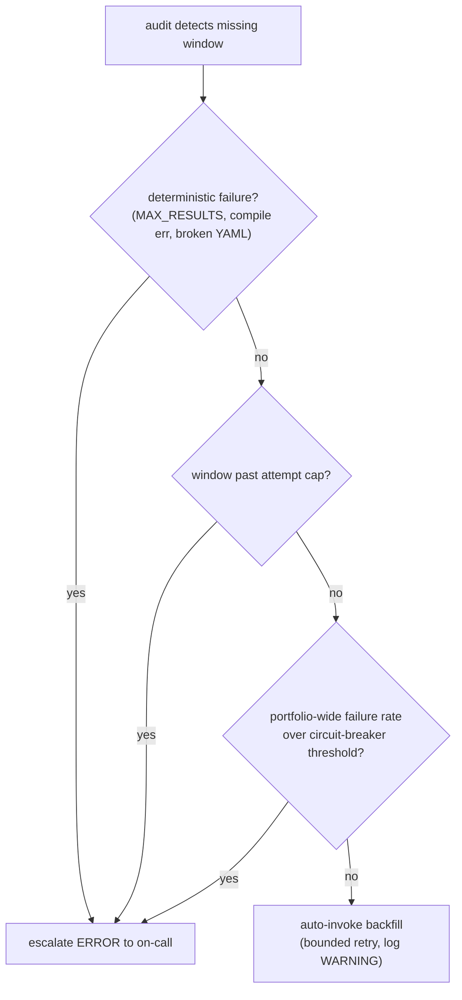

# Self-healing isn't a default

The audit Lambda in the pipeline I've been writing about runs every fifteen minutes. Its job is to enumerate every cron tick that should have produced an aggregated window over the last few hours, diff that set against the `completed/` markers actually present in S3, and emit a structured ERROR log for every gap. On-call gets the alert, runs an `aws lambda invoke` command from a runbook, and the backfill Lambda picks up the missed window, replays it, writes the marker, closes the gap.

Looking at that flow, the obvious question is: _why isn't the audit Lambda just calling the backfill Lambda directly?_ The audit knows the asset, the window, and the remediation command. The backfill function is right there. We could skip the page, skip the runbook, and let the system heal itself.

I almost shipped that design. What stopped me was sitting down and writing out the failure modes the audit would actually be reacting to.

## The seductive default

Auto-recovery is the default the cloud-vendor blog posts sell you, and they're not entirely wrong. Most gaps in this pipeline are transient: a Coralogix 5xx, an EventBridge missed fire, a Lambda cold-start that ate the first fifteen seconds of the minute, an async-invoke that retried twice and DLQ'd despite the work succeeding. Each of these recovers cleanly on the next attempt. Auto-heal on those failure modes pays for itself instantly: the page never fires, the gap closes, on-call sleeps through it.

The natural design follows from there. Detect a gap, invoke backfill, log the recovery. Done. It looks structurally identical to the controller pattern Kubernetes uses for everything, and that resemblance was enough to convince me for the first few weeks of building.

The trouble is that not every gap is transient.

## Three classes, three different right answers

When I went back and categorized every gap I'd actually seen in this pipeline since it shipped, the failures sorted into three buckets cleanly enough that the categories felt load-bearing rather than retrofitted.

**Transient.** A 5xx from a downstream API, an EventBridge rule that fired but Lambda couldn't scale fast enough, an async-invoke that DLQ'd despite the work succeeding. The textbook auto-heal cases. The next attempt will probably succeed; the probability of repeated failure on the same window is low.

**Deterministic.** `MAX_RESULTS` from a query that exceeded the row cap. A DataPrime compile error introduced by a recent merge. A broken YAML for a single asset. An IAM permission missing after a Terraform apply. These are not retry candidates. The next attempt will fail in exactly the same way as the first. Auto-recovery on these doesn't recover anything; it generates retry storms that drown the logs and burn through the downstream's rate-limit budget without making progress.

**Systemic.** Coralogix is down. Datadog is having a tenant-wide ingest issue. EventBridge has a regional outage. Half the portfolio is missing windows simultaneously. Auto-recovery in this case is _worse_ than doing nothing. Every retry the audit triggers is another query against an already-sick downstream, amplifying the outage and delaying the operator's view of the actual incident.

A naive auto-trigger between audit and backfill handles the first class fine, the second class destructively (retry storms), and the third class disastrously (outage amplification). Two of three categories are auto-heal anti-patterns, which is not the ratio you want from a design choice you're calling self-healing.

## What we shipped

The design that survived the categorization isn't human-always or auto-always; it's _route the gap by which class it falls into_. Concretely:

1. **The audit Lambda reads more state than just `completed/`.** It also checks the `failed/` prefix, where the reconciler writes a marker every time a query terminates in a deterministic-failure state with a parseable reason code (`MAX_RESULTS`, `COMPILE_ERROR`, etc.). A window with a `failed/` marker is in the deterministic bucket and gets escalated, not auto-healed.

2. **An attempt counter governs auto-heal per window.** Each time audit invokes backfill for a gap, it increments `heal_attempts/<asset>/<window_start>.json`. When the counter exceeds three, audit stops auto-invoking and emits an `auto_heal_exhausted` ERROR. The operator sees the page, looks at the counter, and decides. Three attempts over forty-five minutes absorbs most transient failures; anything that survives is something a human needs to look at.

3. **A portfolio-wide circuit breaker governs auto-heal per tick.** If a single audit invocation detects more than eight gaps that would otherwise be auto-healed, audit logs `circuit_breaker_open` and escalates everything in that tick. At portfolio scale, eight simultaneous gaps is no longer a transient blip; it's a systemic incident, and auto-heal at that point amplifies rather than helps. The breaker is a literal cap, configurable per environment.

4. **Counters age out cleanly.** A window stuck at the cap doesn't stay stuck forever. After four hours of quiescence (no new attempts logged) the counter is treated as fresh. This handles the case where a deterministic failure was _fixed_ (somebody merged a YAML correction; somebody rolled back a bad query); the next audit tick gets a fresh retry budget without an operator having to clear the counter manually.

The result is a pipeline that recovers transient failures without a page, escalates deterministic failures immediately, and escalates systemic failures eagerly, which is exactly when you most want a human looking at the dashboard.

## The dials are opinions

This isn't free, and the boundary cases are where the design gets honest. Every category boundary has a heuristic at it, and every heuristic has cases it gets wrong.

The attempt cap of three was chosen from gut feel. If real-world transient failures cluster differently from how I imagined, three is the wrong number. The circuit-breaker threshold of eight is similarly fuzzy. The four-hour reset window assumes a particular cadence of operator response, fast enough that fixed bugs unstick within the same on-call shift, slow enough that the auto-reset doesn't loop indefinitely on a still-broken state.

Every dial in that list is a guess that wants real data. The design needs to be tunable from configuration, the counters need enough observability that you can audit when they fired, and the team needs to be willing to revisit the numbers once incidents start landing in their actual distribution rather than the imagined one.

The thing I'd push back on hardest is the framing that this kind of design is _complicated_. It's three small primitives wired into the audit handler: a `failed/` marker prefix, a per-window counter with a TTL semantic, and a per-tick cap. The complexity isn't in the code; it's in admitting that "self-healing" is a property of a _subset_ of failure modes and that the rest need to escalate. Once you accept that, the implementation more or less writes itself.

Full automation is fine as a goal, and bad as a default. Auto-heal transient failures with bounded attempts. Escalate deterministic failures immediately. Escalate systemic failures eagerly, ideally before the auto-heal would have made things worse. The classification will be wrong sometimes. When it's wrong toward escalation you wake on-call up unnecessarily; when it's wrong toward auto-heal you generate retry storms that mask the signal you needed. The first is a much cheaper bug.

---

This is the third post in a small series on a recent reporting-pipeline project. [Part 1](/blog/six-things-i-learned-observability-pipeline-2026-05) is the lessons-learned tour. [Part 2](/blog/why-we-didnt-use-kafka-2026-05) is about the durability primitive that made the whole thing tractable. Together they sketch out what I think a careful operability story looks like for a small, specific class of infrastructure.
