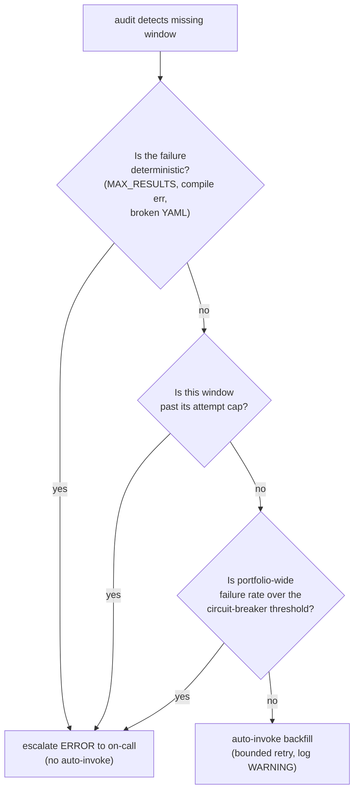

# Why Self-Healing Pipelines Need a Human in the Loop

The pipeline I've been writing about for the last two posts has an audit Lambda that runs every fifteen minutes. Its job is to enumerate every cron tick that should have produced an aggregated window over the last few hours, diff that set against the `completed/` markers actually present in S3, and emit a structured ERROR log for every gap. On-call gets the alert. On-call runs an `aws lambda invoke` command from a runbook. The backfill Lambda picks up the missed window, replays it, writes the marker, and the gap closes.

Looking at that flow, the obvious question is: **why isn't the audit Lambda just calling the backfill Lambda directly?** The audit knows the asset, the window, and the remediation command. The backfill function is right there. We could skip the page, skip the runbook, and have the system heal itself. Why insist on a human in the loop?

I held this position for weeks before I changed my mind. I wanted to write down what changed it.

## The temptation

Self-healing infrastructure is a deeply seductive idea. The pitch from every cloud vendor is variations on the same theme: *write the controller, let it converge, have a coffee.* Operators sleep through the night. Pages get rarer. Mean-time-to-recovery approaches zero. Every gap is just a transient hiccup that the system corrects on its own.

When I started designing the audit Lambda, the natural shape was full automation. Detect a gap, invoke backfill, log the recovery. Done. The reasoning is:

- Most gaps *are* transient. A Coralogix 5xx, an EventBridge missed fire, a Lambda cold-start past the minute, an S3 PutObject hiccup. Each of these recovers cleanly on retry.
- Auto-recovery is silent on the success path. No page, no noise, no on-call burden.
- The audit + backfill machinery is already the right shape: auditing is detection, backfill is remediation. Wiring them together looks structurally identical to the controller pattern Kubernetes uses for everything.

I was sold on this design until I started enumerating the failure modes the audit would actually be reacting to. That's where it fell apart.

## Three classes of failure

When I categorized every gap I'd actually seen in the pipeline since it shipped, the failures sorted into three buckets:

**Transient.** A 5xx from a downstream API. An EventBridge rule that fired but Lambda failed to scale fast enough. A Lambda cold-start that ate the first 15 seconds of the minute. An async-invoke that retried twice and DLQ'd despite the work succeeding. These are the textbook auto-heal cases. The next attempt will probably succeed. The probability of repeated failure on the same window is low.

**Deterministic.** `MAX_RESULTS` from a query that exceeded the row cap. A DataPrime compile error introduced by a recent merge. A broken YAML for a single asset. An IAM permission missing after a Terraform apply. These are not retry candidates. The next attempt will fail in exactly the same way as the first. Auto-recovery here doesn't recover anything; it generates retry storms that drown the logs and burn through your downstream's rate limit without making progress.

**Systemic.** Coralogix is down. Datadog is having a tenant-wide ingest issue. EventBridge has a regional outage. Half the portfolio is missing windows simultaneously. Auto-recovery in this case is *worse* than doing nothing. Every retry the audit triggers is another query against an already-sick downstream, amplifying the outage and delaying the operator's view of the actual incident.

A naive auto-trigger between audit and backfill handles the first class fine. It handles the second class destructively (retry storms). It handles the third class disastrously (outage amplification). Two of the three categories are auto-heal *anti-patterns*. Treating them all the same is what makes self-healing infrastructure scary instead of helpful.

## The half-step we shipped

Once the three-class breakdown was on paper, the design wasn't "human always" or "auto always". It was *route the gap based on which class it falls into.* Concretely:

1. **The audit Lambda reads more state than just `completed/`.** It also checks the `failed/` prefix, where the reconciler writes a marker every time a query terminates in a deterministic-failure state with a parseable reason code (`MAX_RESULTS`, `COMPILE_ERROR`, etc.). A window with a `failed/` marker is in the *deterministic* bucket and gets escalated, not auto-healed.

2. **An attempt counter governs auto-heal per window.** Each time audit invokes backfill for a gap, it increments `heal_attempts/<asset>/<window_start>.json`. When the counter exceeds three, audit stops auto-invoking and emits an `auto_heal_exhausted` ERROR. The operator sees the page, looks at the counter, and decides. Three attempts over forty-five minutes is enough to absorb most transient failures; anything that survives is something a human needs to look at.

3. **A portfolio-wide circuit breaker governs auto-heal per tick.** If a single audit invocation detects more than eight gaps that would otherwise be auto-healed, audit logs `circuit_breaker_open` and escalates everything in that tick. The reasoning: at portfolio scale, eight simultaneous gaps is no longer a transient blip; it's a systemic incident, and auto-heal would amplify it. The breaker is a literal cap, configurable per environment.

4. **Counters age out cleanly.** A window stuck at the cap doesn't stay stuck forever. After four hours of quiescence (no new attempts logged), the counter is treated as fresh. This handles the case where a deterministic failure was *fixed* (somebody merged a YAML correction; somebody rolled back a bad query); the next audit tick gets a fresh retry budget without an operator manually clearing the counter.

The result is a pipeline that recovers transient failures silently, escalates deterministic failures immediately, and escalates systemic failures *eagerly*, which is the right behavior, because a wave of simultaneous gaps is exactly when you most need a human to look at the dashboard.

## What it costs

This isn't free. Every category boundary has a heuristic at it, and every heuristic has cases it gets wrong. The attempt cap of three was chosen from gut feel; if real-world transient failures cluster differently from how I imagined, three is the wrong number. The circuit-breaker threshold of eight is similarly fuzzy. The four-hour reset window assumes a particular cadence of operator response: fast enough that fixed bugs unstick within the same on-call shift, slow enough that the auto-reset doesn't loop indefinitely on a still-broken state.

The honest answer is that **the boundary between auto-recover and escalate is your hardest design problem in any self-healing pipeline.** It's not "build the controller and let it converge." It's "draw the line, draw it carefully, give yourself dials to tune it, and watch what happens." Every dial in the implementation above (three, eight, four hours) is an opinion. Most of them are wrong on first guess and need revising once you have data.

## Where this leaves me

I don't think full automation is bad. I think it's *not the default*. The default for a self-healing pipeline should be:

- **Auto-heal transient failures, with bounded attempts.**
- **Escalate deterministic failures immediately, with no retries.**
- **Escalate systemic failures eagerly, ideally before the auto-heal would have made things worse.**

Drawing the line between those three categories is the work. The categories don't announce themselves; you have to build the classification machinery, encode it in the audit handler, and accept that the categorization will be wrong sometimes. When it's wrong toward escalation, you wake on-call up unnecessarily. When it's wrong toward auto-heal, you generate retry storms that mask the signal you needed.

Both are real costs. I'd rather pay the first.

This is the third post in a small series on a recent reporting-pipeline project. [Part 1](/blog/six-things-i-learned-observability-pipeline-2026-05) is the lessons-learned tour. [Part 2](/blog/why-we-didnt-use-kafka-2026-05) is about the durability primitive that made the whole thing tractable. This one is the second of two architectural-decision posts; together they sketch out what I think a careful operability story looks like for a small, specific class of infrastructure.
