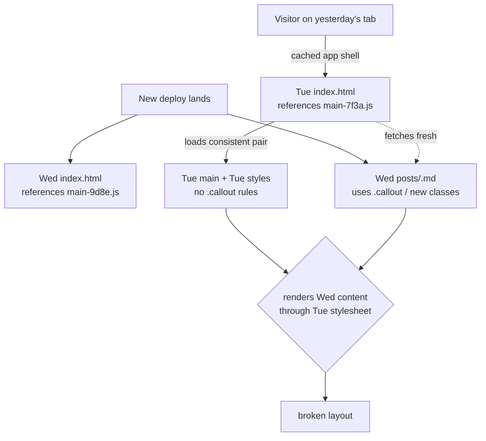
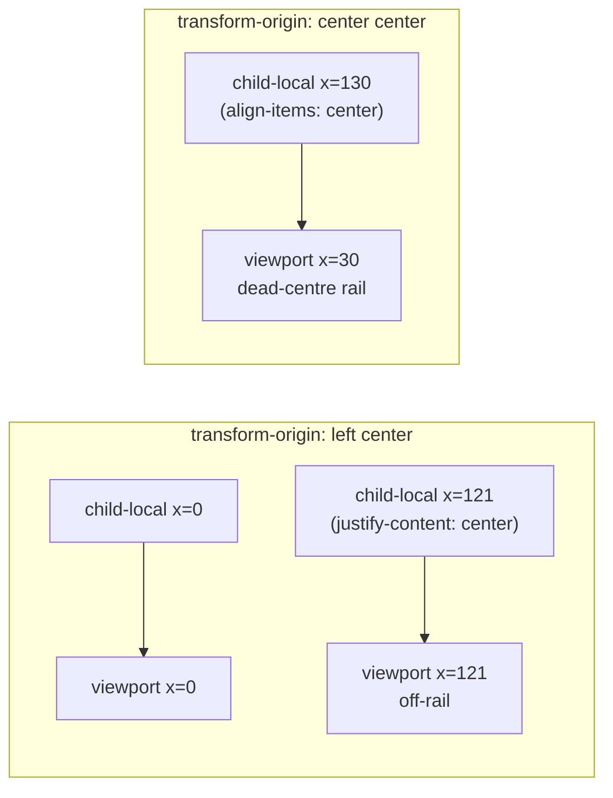

# Shipping fresh CSS after deploy: lessons from a stale-client debugging session

Every static site goes through the same rite of passage. You ship a build, hard-refresh on your dev machine, see it lands clean, and a day later a friend pings you with a screenshot of broken layout on a page they swore worked yesterday. They hit Ctrl-Shift-R and the screenshot turns back into your design. The code is fine. The deploy is fine. The browser, very reasonably, is doing exactly what you told it to do.

This post is the story of chasing that bug across an Angular 21 SSG + service-worker stack and the four lessons that fell out of it. Two are about freshness and how a static site keeps its promises across a deploy; two are about responsive geometry — the kind of CSS that has a correct answer, you just have to do the math.

## Lesson one: content-hashed assets are necessary, not sufficient

The symptom was specific. After a deploy, a visitor on the previously-loaded SPA would `routerLink` to `/blog/<slug>` and get a half-styled page: prose rendered, code blocks unstyled, tables collapsed, mermaid diagrams missing. Hard refresh fixed it.

The instinct says "service worker caching" and the instinct is right, but the explanation that gets you to a real fix takes one more step. Angular emits content-hashed filenames (`main-7f3a.js`, `styles-9d8e.css`) so that two builds never collide in the HTTP cache. That's the half of the story everyone gets right. The half that goes wrong is the **app shell**: the `index.html` that decides which hashed bundle to load. The hashed CSS and JS are fine — they're internally consistent because the cached app shell points at one matching pair. The breakage is when the cached shell starts serving fresh _content_ (markdown bodies, manifest JSON, image assets) that was authored against the new stylesheet. The new content quietly relies on CSS rules — a new `.callout` admonition, a new `.mermaid` container variant, a new image-collage grid — that Tuesday's stylesheet hasn't shipped yet. The tab is a frozen snapshot of Tuesday rendering Wednesday's prose, and the rules don't line up.



The fix is to make the app shell its own first-class freshness signal. In our case that meant two layers working together.

## Lesson two: a belt-and-braces version stamp

Angular's `SwUpdate` API is the textbook answer here — subscribe to `versionUpdates`, listen for `VERSION_READY`, call `activateUpdate()`, reload at a safe boundary. We did all of that, and it works the way it advertises itself when the service worker has actually checked for updates. The cases where it doesn't are the interesting ones:

- A visit shorter than `registerWhenStable` never registers the SW, so it never sees the new manifest.
- A user has the SW disabled (a few percent of visitors do).
- The SW is itself stuck on an old precache manifest — rare, but the failure mode is "indefinitely stale until someone clears storage."

Belt-and-braces means a second, independent freshness signal that doesn't depend on the SW being awake. We added a build-time version stamp: the build script writes a `version.json` containing the git SHA, and the same SHA is baked into the JS bundle at compile time as `APP_VERSION`. The runtime fetches the file with `cache: 'no-store'` on tab refocus and on a five-minute timer:

```ts
private async checkVersionStamp(): Promise<void> {
  if (this.pending) return;
  if (typeof fetch !== 'function') return;
  try {
    const res = await fetch('/version.json', { cache: 'no-store' });
    if (!res.ok) return;
    const body = (await res.json()) as { id?: unknown };
    const id = typeof body.id === 'string' ? body.id : null;
    if (!id || id === APP_VERSION) return;
    if (this.sw.isEnabled) {
      try {
        const found = await this.sw.checkForUpdate();
        if (found) await this.sw.activateUpdate();
      } catch {
        /* swallow — a stamp mismatch is a sufficient signal on its own */
      }
    }
    this.markPending();
  } catch {
    /* offline, 404, or aborted — try again next tick */
  }
}
```

A drift detected here flips an internal `pending` flag. The reload itself is deferred to the next safe boundary — the user being idle (`scrollY === 0`), the next router `NavigationEnd`, or the tab regaining focus. That choreography matters: a silent reload mid-read would be a worse experience than the stale layout it replaces. The boundary check answers the question "is this reload going to feel like a navigation the user already initiated?" If yes, take it; if not, wait.

The nginx config gets one matching rule (`Cache-Control: no-cache` on `version.json` and the app shell), and the service-worker config gets a `dataGroup` with `strategy: freshness` so the SW also revalidates against the network on every fetch. Three layers in a row, all pointing at the same answer: the visitor never renders a tab against assets older than the most recent build.

## Lesson three: collapse animations are geometry problems

That same week, a sidebar refactor that animates `width` was rewritten to animate `transform: scaleX` instead — a textbook GPU-friendly substitution. The host pins to a fixed `--sidebar-width: 260px` and the visible rail shrinks to 60 px in the collapsed state via:

```css
:host {
  --sidebar-scale: 1;
  width: var(--sidebar-width);
  transform-origin: left center;
  transform: scaleX(var(--sidebar-scale));
}

:host(.collapsed) {
  --sidebar-scale: calc(var(--sidebar-collapsed) / var(--sidebar-width));
}
```

Direct children counter-scale to keep their content readable. So far so good. The interesting failure mode is what happens to **where things land** inside the now-60 px-wide visible rail.

The host's outer scaleX has its origin at the left edge (x=0). A child that counter-scales with the same `transform-origin: left center` produces a composed transform of identity — child-local x equals viewport x — so anything you draw at child-local x ∈ [0, 60] lands inside the rail. Anything you draw at child-local x ≥ 60 lands off-rail.

Now consider what `justify-content: center` does inside a 260-px-wide row. It puts the icon at child-local x ≈ 121 — well past the visible rail. In the un-collapsed state the math works out, because the visible rail is the entire 260 px. In the collapsed state, the icon vanishes off-screen.



The fix is two different transform-origins on two different children:

- `.nav-list` keeps `transform-origin: left center` because its `::before` active-item indicator pins to `left: 0` and has to track the rail's left edge. Nav icons are anchored via `padding-left` instead of `justify-content: center`.
- `.sidebar-header` and `.sidebar-footer` use `transform-origin: center center`. The host's outer transform at origin x=0 composes with the child's inner transform at origin x=130 to produce a translation of `viewport x = child-local x − 100`. A footer button placed at footer-local x=130 (via `align-items: center` on a column flex) lands at viewport x=30 — dead-centre of the 60-px rail.

The header's avatar already used this composition; the footer just needed to learn the same trick. The buttons themselves get `width: auto` in the collapsed state instead of `width: 100%`, so their visible chrome (border on the theme toggle, fill on the resume CTA) doesn't extend past the rail edges and clip.

The general lesson — write down the math. CSS transforms compose multiplicatively across nested origins, and a one-line `transform-origin` change is the difference between content rendering at viewport x=30 and viewport x=130. You can stare at the rendered pixels for a long time before the geometry surrenders.

## Lesson four: heading permalinks are a desktop-only affordance

The same audit caught one more thing. Every heading in a blog post emits a permalink anchor — the chain icon you see hovering over `## Section`. On desktop it's parked in the gutter to the left of the heading via `position: absolute; left: calc(-1 * var(--space-6))`. Hover the heading, the icon appears, the heading text doesn't move.

On mobile there is no gutter. The first attempt rendered the icon inline at the start of the heading via `position: static`, which meant the heading text shifted rightward by ~30 px every time the icon was hover-revealed. That's a different visual contract from desktop, where the heading anchors to the column edge regardless of icon visibility.

You can spend a long time trying to make the static-position case work. Negative left margins clip on narrow phones. Absolute positioning at `right: 0` strands the icon far from the text it permalinks. Permanent left-indenting every heading misaligns mobile typography from desktop. Each fix trades one usability problem for another.

The answer is to look at what shipping sites actually do. GitHub, MDN, Stripe Docs, Tailwind Docs, Vercel Docs, the Docusaurus and Astro Starlight defaults — every one of them hides the heading-anchor reveal on mobile and exposes it only on desktop. The reveal is a hover-style affordance, and touch screens don't reliably surface hover. Mobile users who want to share a section copy the URL from the address bar and use the native share sheet.

```css
@media (max-width: 900px) {
  .prose .anchor {
    display: none;
  }
}
```

The functional half of the permalink is unaffected. Every heading still emits `id="..."` from the markdown renderer, so `/post#section` deep links continue to scroll-anchor on every viewport. Only the visible chain icon disappears on mobile. The heading text stays anchored to the column edge regardless of state.

## What the four lessons share

Two themes pull through all of this. The first is that **freshness is a system property, not a setting**. There's no single switch labelled "make this page non-stale"; there's a chain of caches (HTTP, service-worker precache, app shell, JSON manifests) and the chain is only as fresh as its weakest link. Designing for freshness means making each link revalidate on its own and making the failure mode of any link invisible to the visitor.

The second is that **CSS layout is geometry, and geometry has a correct answer.** Whether it's where a 60-px rail centres its content, or where a 16-px chain icon sits relative to a heading's baseline, the moves that work are the moves you can derive on paper. The moves that almost work are the moves you guessed at. The cure is the same in both cases: write down the math, name the origin, name the unit, and the right answer falls out.

A static site that ships fresh CSS to every visitor every time, on every viewport, isn't a single feature. It's a few small invariants enforced in different places — and a willingness to do the geometry.
