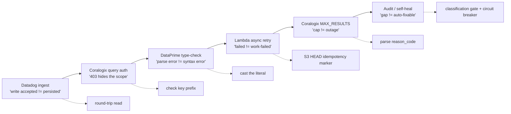

# Six layers that lied

The first backfill of the new pipeline returned `rows_emitted: 200` to its caller. No error, no `4xx` HTTP status, no activity in the dead-letter queue (the DLQ, the side-channel where AWS parks events a function couldn't process), and zero metrics showing up in Datadog, the monitoring service we send our charts to. The logs from our AWS Lambda functions, the small stateless workers that spin up to handle a single event and then vanish, looked clean end to end. The window we were trying to recover was eighteen hours old, and it was still empty.

That ended up being the cheapest of the six bugs in this post, and it's still a half-day I want back. The project was a fairly ordinary observability migration: thirty-day SLA reporting moving off Splunk Summary Indexing onto a Lambda pipeline that aggregates inside Coralogix (a log and query platform, the place our raw events live) and emits the results to Datadog. The shape of the pipeline is roughly what you'd guess. Per-asset YAML config files describe what to measure. An EventBridge cron, AWS's scheduled timer, fires a submit handler every minute. A reconciler polls Coralogix for queries that have reached a terminal state, meaning finished, whether they succeeded or failed. A publisher fans the aggregated rows out to Datadog metrics. An audit job catches gaps. And a backfill handler covers the rare case the audit can't fix on its own.

Each of those boundaries is a place where one system hands work to another, and at every one of them something lied to me about what had actually happened. Here are six of those layers, and the small assertions that caught them.

## Datadog drops historical metrics silently unless you opt in

The eighteen-hour-old window came back empty because of a Datadog feature called [Historical Metrics](https://docs.datadoghq.com/metrics/custom_metrics/historical_metrics/), the setting that lets you submit data points stamped with a time from outside the last hour. It is opt-in _per metric name or namespace prefix_. Not org-level, not workspace-level, but per-prefix, meaning you flip it on for a specific family of metric names. Standard custom metrics only accept points inside roughly the last hour. So without the feature on, every point your SDK (the Datadog client library running inside our publisher) uploads with an older timestamp gets dropped at the ingest gateway, the front door where Datadog decides whether to keep your data. In our case nothing came back to the SDK to say so, and there was no telemetry on the publisher side either. The only signal was that the metric I swore I wrote was missing from the dashboard.

The fix is one click in the metrics summary UI: pick the prefix, set Enable historical metrics to on. After that, the [documented latency tiers](https://docs.datadoghq.com/metrics/custom_metrics/historical_metrics/) kick in, and they are slower than the live path. Points under an hour old are near-instant. One to twelve hours back ingests within the hour. Twelve hours to thirty days can take up to fourteen hours to show up, so a deep backfill kicked off in the afternoon is realistically a next-day result, not a same-session one. Worth knowing before you sit there refreshing a dashboard.

The pattern this represents is more interesting than the bug. Vendor APIs frequently distinguish _write accepted_ from _data persisted_, and the gap between those two states tends to be invisible from the client: the API says "got it" and quietly discards the data later, somewhere you can't see. The discipline I now apply: any time I'm writing to a vendor API for a use case that isn't the obvious happy path, I write one round-trip integration test that asserts the data shows up where I expect to read it. A round-trip test just means I write, then immediately read back, and check the two agree. Cheap, ugly, catches this entire class of failure.

## API key prefixes gate endpoints, not just accounts

For three days every scheduled invocation of the submit Lambda returned `HTTP 403: Permissions are not granted` from Coralogix's DataPrime endpoint, where DataPrime is Coralogix's query language and the `/api/v1/dataprime/*` URL is how you run it over HTTP. No row was written to the in-flight ledger, the small record we keep of queries that are still running, so the reconciler had nothing to reconcile, and the publisher was never invoked. The pipeline looked busy from the outside (Lambdas firing, no Lambda errors, the EventBridge rules active) and was doing nothing.

The fix was one character. Coralogix splits ingest and query behind [separate key presets](https://coralogix.com/docs/user-guides/account-management/api-keys/send-your-data-api-key/), where a preset is just a bundle of permissions, called a scope, baked into the key. The `cxup_*` prefix carries the Data Querying scope that `/api/v1/dataprime/*` requires, and the `cxtp_*` prefix carries the Send-Your-Data scope the ingest endpoints want. The secret had been populated with a `cxtp_*` key, the wrong half of the pair. Both keys belong to the same account, both have valid permissions for _something_, and the 403 response carries no hint about which scope is missing. You get the same body for a typo, an expired key, a downed service, and a scope mismatch.

The cost-multiplier on this bug came from a second layer. After the secret was rotated, every Lambda kept returning 403 for hours. The cause: `@lru_cache`, a Python decorator that memoizes a function's result so it doesn't recompute, was wrapped around the secret-fetch helper and holding the stale value inside the warm container. ("Warm" because Lambda keeps a recently-used worker alive and reuses it; the cached old secret rode along.) The fix was setting a throwaway environment variable to force a cold start, where a cold start is Lambda booting a brand-new worker from scratch with nothing cached. I'd recommend baking that into your secret-rotation runbook regardless of whether you've ever hit this.

When a vendor's secret-rotation flow involves more than one possible scope, validate the prefix of what landed in your secret store before you ship.

## DataPrime types matter at compile time, not query time

This one bit me on a stitch filter, a clause I splice into every generated query, that injected `| filter time_bucket >= '2026-05-19T14:00:00+00:00'` to bound the time range. It compiled cleanly in local tests against synthetic data, ran fine in the dev console, and returned `HTTP 400 expected keyword ')'` in production, with the parser pointing at a parenthesis four lines below the actual problem.

Here is why. `time_bucket` is a `timestamp`-typed column produced by `roundTime(_time, 1m)`, meaning each value is a genuine point in time, not text. The right-hand side of the comparison is, by default, a string. DataPrime is [statically typed](https://coralogix.com/docs/dataprime/language-reference/types/), which means it checks that the types on both sides of an operation line up at compile time, before the query ever runs, and it won't quietly coerce a string into a timestamp for you. The compiler fails the parse and emits an error pointing at the spot where it tried and failed to reconcile the two types, called the unification site, rather than at the literal value that caused it. The fix is the postfix cast the rest of the query language already uses for `:string` and `:number`, where a cast just tells the compiler "treat this value as that type":

```sql
| filter time_bucket >= '2026-05-19T14:00:00+00:00':timestamp
      && time_bucket <  '2026-05-19T15:00:00+00:00':timestamp
```

The general shape is worth holding onto. A type error can wear the costume of a syntax error when the compiler reports where unification failed instead of where the literal sits. Whenever a query compiles locally and fails remotely with a parse error pointing somewhere implausible, suspect the type-checker before the parser, and look for any literal compared against a structurally typed column.

## Async retries amplify non-idempotent emissions

Lambda's async-invoke retry behavior is one of the more quietly dangerous defaults I've shipped against. An async invoke means the caller fires the event and walks away without waiting for a result, which is how the reconciler kicks off the publisher on every window that finished successfully. By default [Lambda retries a failed async invocation up to two more times](https://docs.aws.amazon.com/lambda/latest/dg/invocation-async-error-handling.html), waiting about a minute then about two minutes, before the event goes to the DLQ. The catch is that "failed" is decided by the runtime, [not by your code](https://docs.aws.amazon.com/lambda/latest/dg/invocation-async-error-handling.html): a function timeout counts as a function error. So a successful emit followed by an SDK-close timeout, a cold-start hang, or a network blip past the function's return flips the invocation to failed even though the work landed. This is what "at-least-once delivery" means: the platform guarantees your event arrives, but it might arrive more than once, so your function can and will see the same event again.

That is harmless until the emit isn't idempotent, where idempotent means running it twice has the same effect as running it once. Datadog [distribution metrics](https://docs.datadoghq.com/metrics/distributions/), which is what you use to compute percentiles, forward every raw sample to the server and aggregate there. (A percentile like p99 is the value 99 percent of your samples fall under, the standard way to talk about worst-case latency; a distribution metric ships the raw numbers so the server can compute that, unlike a plain count that only ships a running total.) Re-running an already-successful publisher resends those samples, and the p99 quietly drifts upward. Nobody pages, because the dashboards don't look broken; they look slightly off in a way that's easy to dismiss.

The fix is a producer-side idempotency marker, a small record the producer writes to prove it already did the work. After a successful emit, write a `published/{asset}/{window_start}.json` object to S3, Amazon's object storage. HEAD-check it at the start of every publisher invocation, where a HEAD request just asks "does this object exist?" without downloading it. If the marker exists, log a `publisher.skip_already_published` event and return. The cost is one S3 HEAD plus one S3 PUT (a write) per window. The benefit is one distribution emission per window, no matter how many times the runtime decides to replay the event.

Because the retry is invisible to the function that succeeded, dedupe has to live with the producer that can replay, not the sink that receives. The sink never sees enough to do it for you.

## `MAX_RESULTS` is a tuning signal, not a retry-failure

Coralogix's background-query API, the interface for queries that run too long to wait on synchronously, caps each query at one million result rows. Exceeding the cap returns a terminal-failure status with `MAX_RESULTS` in the error body. This is not transient and it is not retryable: running it again will fail the exact same way. It is the platform telling you that your `(query, window_size, traffic_volume)` triple no longer fits and asking you to tighten the window, meaning ask for a shorter span of time so fewer rows come back.

The trap is treating it as a generic failure. When traffic on one asset doubled overnight, the reconciler started classifying every hourly tick as a terminal-error window and routing it to the regular ERROR-log alert. On-call got paged at three in the morning. The runbook said _investigate_, which led to a forty-minute investigation that ended with _yeah, traffic doubled, halve the window_. The platform was working as intended; the alert was working as intended; the _classification_ was wrong.

The fix is structural. Parse the terminal-failure body for the reason code, and route the `MAX_RESULTS` case to a remediation-bearing log line, one that tells whoever reads it exactly what to do, rather than a generic ERROR:

```text
ERROR reconcile.terminal_failure
  reason_code=MAX_RESULTS
  remediation="tighten lookback_window for asset=<x> in its YAML"
```

The downstream alert rule then knows: a `MAX_RESULTS` signal is a YAML edit, not an outage. Error semantics are part of your alerting architecture, not a debugging aid you decode after the fact.

## Self-healing pipelines need guardrails

The audit job in this pipeline runs every fifteen minutes, diffs the cron ticks it expected to see against the `completed/` markers actually on disk, and emits an ERROR per missing window. The natural next step, the one I almost shipped, is to wire the audit directly to backfill: gap detected, backfill invoked, on-call never paged. Self-healing infrastructure, the way the cloud-vendor pitches always promise.

Don't ship that until you've thought through what it does on a deterministic failure (one that fails the same way every time you try) or a systemic outage (one where the whole downstream is sick, not just your one window).

A `MAX_RESULTS` window will deterministically fail under retry. So will a query that won't compile, a YAML that won't parse, an IAM permission (an AWS access grant) that hasn't propagated yet. Auto-recovery on those generates retry storms that drown the logs and burn through your downstream's rate limit without making progress. And when the failure is systemic (Coralogix down, a Datadog tenant incident, an EventBridge regional outage), auto-recovery actively makes the outage worse: every retry is another query against an already-sick downstream, the software equivalent of repeatedly slamming a jammed door.

The shape of the right answer is a classification gate, a check that sorts failures into "safe to retry" and "stop and escalate" before any retry fires. Bound retries per window, and page on the cap. Add a portfolio-wide circuit breaker, a switch that trips open and halts retries once failures cross a threshold, so a wave of simultaneous gaps escalates eagerly rather than quietly hammering. Reset the attempt counters after a quiet period so a fixed bug unsticks on its own. None of this is hard; the hard part is admitting that "self-healing" only applies to a subset of failure modes, and then doing the classification work to tell that subset from the rest.

I get into the actual mechanics in [Part 3 of this series](/blog/self-healing-needs-a-human-in-the-loop-2026-05).

---

The thing all six of these have in common is a layer that didn't say what it actually meant. The platform accepted a write but didn't store it. The 403 didn't mention scope. The compile error blamed the wrong line. The retry was invisible to the function. The terminal failure was indistinguishable from an outage. The self-healing wanted to retry an undecidable failure forever. In every case the fix was the same kind of move: a small, specific assertion at the seam, deliberately hung off the happy path.



The lies ride the main flow; the assertions hang off the bottom as checks you have to choose to make. Boundaries between systems are where lies live, and the only defense is to make the boundary check explicit.

[Part 2](/blog/why-we-didnt-use-kafka-2026-05) takes on a related architectural decision that fell out of all this: why we didn't reach for Kafka, the popular event-streaming queue, even though "use a queue" is the obvious instinct.

### Further reading

- [Datadog: Historical Metrics Ingestion](https://docs.datadoghq.com/metrics/custom_metrics/historical_metrics/)
- [Datadog: Distributions](https://docs.datadoghq.com/metrics/distributions/)
- [AWS Lambda: error handling and retries for asynchronous invocation](https://docs.aws.amazon.com/lambda/latest/dg/invocation-async-error-handling.html)
- [Coralogix: DataPrime types](https://coralogix.com/docs/dataprime/language-reference/types/)
