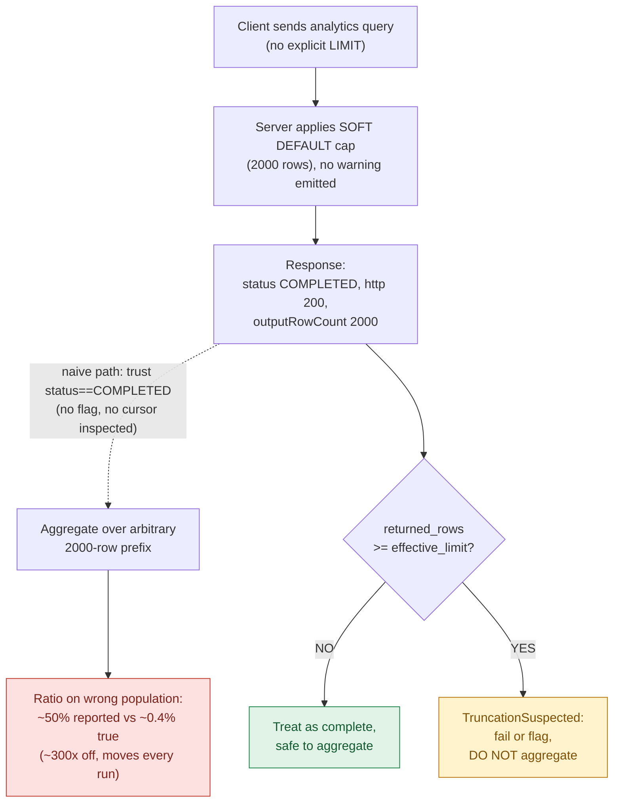

# Success is not completeness

A failure-rate metric on a dashboard I owned sat at roughly 50% for most of a morning. It was confident and stable. Not spiking, not flapping, just a flat line at a number that should have triggered a page (woken someone up via the on-call alert system). The truth was a fraction of a percent. No error, no truncation warning, no failed request anywhere in the chain. The query returned `COMPLETED` every time, and the aggregate it fed was about 300x off on a number that carried a contractual penalty.

The bug was not in my math. The API had answered a different question than the one I asked, then told me it had answered mine.

## The clean-looking lie

I was running an analytics query against a data API, the kind of HTTP endpoint you hand a query to and get rows back, without specifying a result limit (a cap on how many rows you are willing to receive). The response came back with status `COMPLETED`, an `outputRowCount` of exactly 2000, and nothing else: no flag, no warning field, no partial-result indicator. The volume and scan limits were untouched, so this wasn't the backend protecting itself from a huge payload. It was a default row-count cap, applied silently because I hadn't said otherwise.

That distinction matters. A data-size guard, a backend refusing to scan too many bytes, would have shown up as bytes-scanned pressure I could have watched on a graph. A row-count default leaves no fingerprint anywhere I would think to look. The query planner, the part of the engine that decides how to fetch and assemble your results, returned the first 2000 rows it assembled, marked the call successful, and moved on. Every layer downstream read `COMPLETED` plus a clean HTTP status as "you have the data."

But a successful response describes the transaction, not the dataset. It tells you the call went through, not that the answer is whole. This isn't a quirk of one vendor. [An HTTP 200 means the request "has succeeded"](https://developer.mozilla.org/en-US/docs/Web/HTTP/Reference/Status/200), the standard "everything is fine" status code, and what that implies is method-dependent. A HEAD request (one that asks only for headers, no body) returns 200 with no body at all; a POST (a request that creates or triggers something) can return 200 for an action that is merely pending. The status answers "did the call resolve?" It makes no promise that the rows you got are the rows that exist.

## A capped aggregate is worse than a missing one

A missing result is loud. A capped one, an answer quietly cut off at the limit, is quiet and plausible, which makes it far more dangerous.

When you aggregate over a truncated read (run a sum, count, or rate across rows that were silently cut short), you are aggregating over an arbitrary subset. The 2000 rows I received were not a representative sample; they were whatever the engine produced first, with no guarantee that the ordering correlated with anything I cared about. So both the numerator and the denominator of the rate were computed against the wrong population. My failure rate looked like 50% because the truncated slice happened to be heavy with failures. Another run over slightly different data would have landed somewhere else.

That non-determinism, the fact that the same query yields a different answer each run, is the tell people miss. A broken pipeline that returns nothing gets noticed by lunch. A pipeline that returns a different wrong number every run gets rationalized: metrics are noisy, let's wait for it to settle. It never settles, because nothing is converging. You are sampling an arbitrary prefix (the first chunk, in whatever order the engine happened to produce) of an unordered result each run.

```text
true population:   80,000 rows,  ~0.4% failures
returned:           2,000 rows,  failure share ~50%
ratio off by:      ~300x, and it moves every run
```

So silent truncation doesn't just cost precision; it voids the validity of every ratio built on top of it. A wrong-but-stable number earns trust it hasn't paid for; a wrong-and-unstable one gets dismissed as noise. Both are worse than an empty result, which at least announces itself.

## The assertion that catches it

With no warning field to read, you need a tell that doesn't depend on the vendor volunteering one. An assertion here just means a check that throws a loud error the moment a condition you care about is violated. The cheapest reliable one compares the rows you got back against the limit in effect.

```python
if returned_rows >= effective_limit:
    raise TruncationSuspected(
        f"got {returned_rows} rows at limit {effective_limit}; "
        "result is suspect, not complete"
    )
```

If `returned_rows == limit`, you almost never have exactly that many real rows. You have a result that hit the ceiling. The right reading of equality to the limit is "probably truncated," not "happened to fit perfectly." Treat it as suspect and force the question: was this capped?

The check does false-trip (fire when nothing is actually wrong) when the true count lands exactly on the limit, the one case where a complete result and a capped one look identical. That is the price of a guard costing a single comparison, and it is cheap insurance: a spurious red is annoying, a silent green is a contractual penalty.

There is a stronger signal where it exists. Cursor-based APIs, the kind that hand back a bookmark pointing at the next page of results, answer "is there more?" exactly. If the response carries a `next_cursor`, `pageToken`, or `LastEvaluatedKey` (three vendors' names for that same next-page bookmark), there is more. Prefer that when the contract gives it to you, and fall back to `returned >= limit` only when it doesn't.

One subtlety: you must know the _effective_ limit, the number actually in force, including the default you never set. If you don't pass a limit, the limit is not "none"; it is whatever the server picked, and that is the number your assertion compares against. The day I added this check, the green query turned red, which is what I wanted. A failure I can see beats a success I can't trust.

## Why the absence of a warning means nothing

Here is the part that cost me a half-day. I assumed that because the API warned on some limits, the absence of a warning meant completeness. It does not.

Many data APIs treat the limit _you_ set and the default _they_ apply as two different paths. Pass an explicit `LIMIT` (the clause that tells the query how many rows you'll accept), exceed it, and you often get a flag, because the system knows you stated an expectation and can tell you it was clipped. The soft default, the cap the server quietly applies when you stay silent, ships without a peep. So "no warning" is consistent with both a complete result and a silent cap at a default you didn't know existed, and you can't use the warning channel to tell those two states apart.

The deeper reason this is vendor-specific: most well-designed APIs don't signal incompleteness through a warning at all. They signal it through a cursor you are expected to follow. [BigQuery's list methods default `maxResults` to 10,000](https://docs.cloud.google.com/bigquery/docs/paging-results), Google's data-warehouse query service, and hand back a `pageToken` for the rest, a default you inherit even if you never set one. So read the docs for what triggers the signal and which channel carries it, then assume the default path is unmonitored.

## The shape repeats everywhere

Once you have seen this, you start finding it across half your stack, because the failure shape doesn't change with the vendor.

- **Pagination** (serving big results in fixed-size pages instead of all at once) that returns the first page plus a cursor you forgot to follow. In [DynamoDB, AWS's key-value database, a single Query caps at 1 MB](https://docs.aws.amazon.com/amazondynamodb/latest/developerguide/Query.Pagination.html) and signals more data only through `LastEvaluatedKey`. Its absence is the _entire_ end-of-results contract.
- **Trace backends** (systems that store the timing records of requests as they hop through your services) that sample, meaning they keep only a fraction of records to save space. Your p99, the latency value 99% of requests come in under, a common way to track tail slowness, is computed over the records that survived sampling, not the requests that happened. [OpenTelemetry, the open standard for this telemetry, is blunt about this](https://opentelemetry.io/docs/concepts/sampling/): a not-sampled record "is not processed or exported," and the docs advise against sampling when you use the data only in aggregate.
- **SQL clients** with a default fetch cap. The driver stops pulling rows at some number and the cursor (the handle you iterate to pull the next batch) just ends. No exception.
- **Search APIs** with a result-window ceiling, where hit 10,001 doesn't exist as far as your aggregation is concerned.

Every one of these reports success while handing you a prefix and letting you mistake it for the whole. "The API returned" and "I have all the matching records" are different propositions, and most data interfaces conflate them by default. The discipline is to ask the second question every time the first one looks fine.

Below is the path my morning took, and the single comparison that would have caught it.



The only thing separating the red result from the deceptive green one is that decision node. Where a cursor exists, checking it is the structurally stronger version of the same guard.

## The fix is layered, not a flag

No single setting makes this go away, because the problem spans the call, the contract, and the cardinality of your data (how many distinct rows the answer actually contains). The defense has three layers.

Start with a **truncation guard**: the `returned >= limit` assertion above, applied where you read results. If it trips, fail or flag, never aggregate. This catches the bug even when everything else is misconfigured.

Then **set the limit explicitly and learn the hard ceiling**. Don't ride the soft default. State a limit so your guard has a known value to compare against, and find out what the _hard_ ceiling, the absolute maximum the server will ever return no matter what you ask, actually is. In my case the soft default was 2000 while the hard ceiling sat in the tens of thousands: headroom I wasn't using because I never asked.

Finally, where true cardinality can exceed _any_ ceiling, **reduce what you ask for** rather than hoping it fits. Group at a coarser grain (bucket by hour instead of by second, say), narrow the time window, pre-aggregate on the server so the math happens before the rows ever cross the wire. The OpenTelemetry guidance lands in the same place from the sampling angle: when you only consume data in aggregate, compute the aggregate close to the source. If a complete answer can't fit under the hard ceiling, raising the limit only pushes the silent failure further out. Make the result smaller than the wall.

Completeness is something you engineer for, not something the response grants you. A status code describes the call, not the data. `200 COMPLETED` means the bytes came back and the connection closed clean. It says nothing about whether those bytes answer your question. Assert your own invariant on completeness, because no system is obligated to tell you what it left out.
