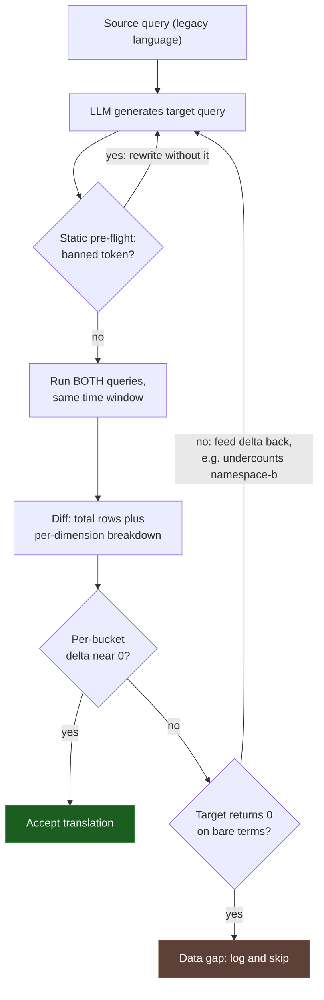

# An LLM is a fine translator the moment you can grade it

The query came back clean. It parsed, it ran against production data without an error, and it returned a few thousand rows that looked like exactly what I expected: a daily pass-rate number sitting in a believable range. I almost signed off on it. Then, out of habit, I ran the original query against the same window. The two numbers disagreed by something like 99 percent. The translation hadn't failed in any way the tools could see. It had succeeded at being wrong.

I had handed an LLM, a large language model like the ones behind Claude or ChatGPT, a query in one analytics language and asked for the equivalent in another. What came back compiled, executed, and lied. I spent the next half day untangling why, and that is the subject of this post, because the lesson reaches well past one pair of query languages.

## The translation that compiled and lied

When you ask a model to port code from one language to another, the feedback you get for free is syntactic. The target parser, the part of the system that reads your query and checks it against the grammar of the language, either accepts the output or rejects it. If it parses, you run it. If it runs, you get rows. Every signal in that loop reports on _form_. None of it tells you whether the output means the same thing as the input.

For a translation task, that is backwards. A syntactically valid query in the target language is the floor, not the ceiling. The failures that matter clear every form check and still compute a different answer, and a compiler is structurally blind to them. It generalizes, too: in any migration, the bugs that reach production tend to be the ones your existing tooling was never built to catch, and form-checkers cannot catch meaning.

The research literature backs this up at population scale. A 2024 study of LLM code translation, [_Lost in Translation_](https://arxiv.org/abs/2308.03109), found correct translations only 2.1 to 47.3 percent of the time across the models it tested, and catalogued fifteen distinct categories of translation bug, plenty of which parse and run. Plausible-but-wrong is not the edge case here. It is a large slice of the distribution: most of the failures the study measured looked perfectly fine on the surface.

## Why "compiles" is a weak signal

"It compiles" tells you the model produced grammar. Producing grammar is the thing modern LLMs are genuinely good at, and it carries almost no information about correctness. The characteristic failure of these systems is a confident, fluent, well-formed answer that happens to be wrong, dressed well enough to pass a glance.

"It runs and returns rows" is barely stronger. A query that drops half its input still returns rows. A query that misclassifies every record still returns a count. On aggregate data, the kind where you have collapsed thousands of individual records down to one summary number like a daily average or a pass rate, plausibility is cheap, because almost any structurally valid query over real data lands somewhere in a believable range.

So the right question to ask of an LLM-produced port is not "does it work?" but "what oracle do I have that can tell me it's wrong?" An [oracle](https://en.wikipedia.org/wiki/Test_oracle), in testing terms, is simply any independent source of truth you can check an answer against, something that knows the right answer without trusting the thing you are testing. If the only oracle you own is the compiler, you have no oracle, because the compiler only ever judges form. The idea predates the current model era: the canonical [Codex evaluation](https://arxiv.org/abs/2107.03374), an early benchmark for code-writing models, grades generated code by _functional_ correctness, running it against tests, rather than by matching it to a reference. The trust you can place in a model on a given task is bounded by the strength of the check you can run on its output, not by how good that output looks.

## Two faces of semantically wrong

My divergence came in two flavors. Both are worth recognizing on sight, because they have recurred in every translation I've done since.

The first is a **function-semantics mismatch**: two functions that claim to do the same thing but quietly disagree on an edge case. The source language's "first matching value" function returned `null`, the placeholder a database uses for a missing or absent value, when the first event in a group simply lacked the field. The target language's nearest equivalent skipped nulls and returned the first _present_ value instead. On a dense field, one that is populated on nearly every event, nobody would ever notice. On a sparse field, one populated in only a small fraction of events, the two functions select different rows, and a downstream pass/fail threshold flips. That is how a query lands 99 percent off.

This is not exotic. SQL has the same trap baked into its standard library: [PostgreSQL's aggregate functions](https://www.postgresql.org/docs/current/functions-aggregate.html) document that most built-in aggregates are strict and drop null inputs, while a few explicitly keep them. Two functions with the same English description, a `first()` against an `any_value()`-style aggregate, do not agree on missing data.

The second is a **hardcoded environment assumption**: a value the model wired in as a constant because the example it learned from happened to have only one. The model pinned a single source literal into the `where` clause, one namespace (think of a namespace as a label that scopes which slice of data a query looks at), because the example it pattern-matched on had exactly one. The real data spanned two. The query silently dropped about half the rows and returned a number that still read as a perfectly valid pass rate.

```sql
-- model emitted (looks fine, drops ~half the data):
filter source == "namespace-a"

-- what the source system actually queried:
filter source in ("namespace-a", "namespace-b")
```

Both bugs share a shape: the output is a number, the number is in range, and nothing in the toolchain objects. The expensive mistakes are the plausible ones, since plausibility is exactly what disarms a review.

## The oracle: diff against the source, then auto-tune

The fix is not a better prompt. It is refusing to evaluate the translation in isolation. As long as the system you're migrating _from_ is still running, you already own a ground-truth generator, so use it. This is [differential testing](https://en.wikipedia.org/wiki/Differential_testing) in its plainest form: a technique where you feed the same input to two implementations that should agree and flag any place they don't. Run both queries over the same window and ask not "does the new one look right" but "is the per-dimension delta against the old one near zero," where the delta is just the difference between the two answers, broken out for each slice of the data.



One scalar, a single summary number, is not enough to compare, because two wrong queries can collide on the same total. Break the result down by every grouping dimension you have, every category you sliced the data by, and require each bucket to reconcile. When a bucket is off, that delta is the most useful thing you can hand back to the model. "Your output undercounts `namespace-b` by 100 percent" points straight at the pinned literal, far faster than I would have found it by rereading the query.

The discipline reduces to one sentence: the LLM proposes, an automatic ground-truth comparison disposes. The model gets to be creative because the diff is not. A model is safe on a translation when you have a cheap, automatic oracle to grade it against, and a migration off a still-running system hands you that oracle for free. The precondition is real, though. It only works because the old system is still up, so don't decommission it until the diff is flat.

## Pre-flight checks, and telling a defect from a gap

Two refinements made the loop cheap enough to run hundreds of times.

First, a static pre-flight, a check that reads the generated text without executing it. Some failures are guaranteed before you execute anything. The target language lacks a keyword the source leans on: no `in`, a different join model, a missing function. Scanning the generated text for a short list of known-unsupported tokens _before_ spending an API round trip, the slow back-and-forth of sending a query off to a remote service and waiting for the answer, turns a slow runtime error into an instant local reject and regenerate.

```python
BANNED = {" in ", "transaction", "earliest("}  # no target equivalent
if any(tok in generated for tok in BANNED):
    regenerate("uses unsupported construct; rewrite without it")
```

Second, and this one saved me from chasing ghosts, separate a _generation defect_ from a _data-availability gap_. A defect is a bad translation; a gap is good code with no data underneath it. If the converted query is structurally sound and the target store returns zero on the bare terms, that is often not a bad translation at all. It means the data the source system had has not landed in the target yet. The distinction is load-bearing: a defect goes back into the tuning loop, a gap gets logged and skipped, because no amount of regeneration will conjure rows that aren't there. Burn iterations re-translating around missing data and you will talk yourself into believing the model is worse than it is.

---

I came out of this trusting LLMs for translation _more_, not less, but only inside the harness, the wrapper of automated checks the model runs inside. The model is a strong, fast, tireless translator, and it is wrong often enough that I will never again grade it by reading its output and nodding along. What changed wasn't the prompt. It was building the diff. An LLM becomes a fine translator the moment you can grade it. Porting one query language to another is a data problem wearing a syntax costume, and "it compiles" is the weakest signal you will ever be offered.

## Further reading

- [_Lost in Translation: A Study of Bugs Introduced by LLMs while Translating Code_ (ICSE 2024)](https://arxiv.org/abs/2308.03109)
- [_Evaluating Large Language Models Trained on Code_ (Codex / HumanEval)](https://arxiv.org/abs/2107.03374)
- [Differential testing](https://en.wikipedia.org/wiki/Differential_testing) and the [test oracle problem](https://en.wikipedia.org/wiki/Test_oracle)
