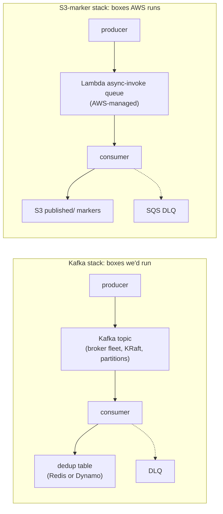

# We skipped Kafka

Queues solve message durability. We needed outcome durability. Same five boxes either way; the difference is who runs them. That's the post.

A few weeks into the project a colleague asked, half-jokingly, whether we'd considered Kafka. The pipeline aggregates large windows of log data on a schedule, emits results to a metrics platform, and tries hard never to lose a window. That's exactly the kind of system Kafka is the canonical answer for, and I got asked some version of the same question three or four times before the architecture settled.

This post is the longer version of the answer.

## Same five boxes

Here's the part that surprised me when I drew it out: the Kafka design and the design we actually shipped have the same number of moving parts. Every primitive Kafka would give you has a counterpart in our stack.

| Kafka primitive             | What it does                                       | Our equivalent                                     | Who runs it    |
| --------------------------- | -------------------------------------------------- | -------------------------------------------------- | -------------- |
| Topic                       | Holds events between producer and consumer         | Lambda async-invoke queue                          | AWS, free      |
| Producer                    | Publishes window-completion events                 | Handler doing `lam.invoke(InvocationType=Event)`   | already exists |
| Consumer                    | Reads events and processes them                    | Downstream Lambda handler                          | already exists |
| Dedup table (Redis, Dynamo) | Tracks which `(asset, window)` keys were processed | `published/<asset>/<window_start>.json` S3 markers | already exists |
| Offset commit log           | Records "this was completely processed"            | `completed/<asset>/<window_start>.json` markers    | already exists |
| Consumer group rebalancer   | Reassigns work when a consumer dies                | Lambda concurrency manager                         | AWS, free      |
| DLQ                         | Catches messages the consumer can't process        | SQS DLQ wired to async-invoke `on_failure`         | already exists |

Same correctness properties either way: at-least-once delivery from the producer, dedup at the consumer, terminal-state markers downstream. The architectural shape is identical. The difference is who runs the substrate.

The Kafka diagram has three boxes someone on the team is on the hook for: the broker fleet, the dedup table, and the partition strategy. Each is a multi-day operability problem at minimum. Brokers want monitoring. Dedup tables want TTL policies. Partition strategy wants thought about traffic patterns and consumer affinity. Every one of those costs is paid for the privilege of getting a primitive that the Lambda runtime already gives us for free, with semantics we've already validated for the rest of the stack.

## Outcome durability is a consumer-layer property

What we were doing was scheduling a few queries against an archive index every minute. Each query produces a `(asset, window_start)` tuple, a one-hour aggregation result. The aggregation either landed in the metrics platform or it didn't. The question the pipeline has to answer (and the question dashboards, audit reports, and on-call runbooks ask) is _did this 1-hour window for asset X get processed?_

That isn't message durability. Message durability lives at the transport layer; it's a property of the queue. The broker stores the message, the broker promises redelivery, the broker holds it until you ack. The consumer can be dumb about idempotency because the buffer is the system of record.

Outcome durability lives at the consumer layer. The dedup state has to be keyed by something the consumer can compute (for us, `(asset, window_start)`), and the consumer has to check that state before doing work. The buffer's job is reduced to _deliver at least once_; the consumer is the system of record for whether the work happened.

If you start the design from outcome durability, you naturally produce something like the `completed/` and `published/` S3 markers we ended up with. If you start from message durability, you produce a Kafka topic, and then, because outcome durability is still the actual requirement, you produce a separate dedup table next to it. You've reproduced the markers anyway, just on infra you operate yourself.

The Lambda async-invoke queue gives us at-least-once delivery for free. It is not great at it. There's no replay-from-offset, no consumer-group fan-out, no message ordering. None of those features were what we needed. We needed _reconciler runs, decides a window is terminal, sends a message to the publisher; if the publisher fails, retry; if it succeeds, leave a marker so retries become no-ops_. Async-invoke does exactly that.

## Where Kafka would have earned its keep

Kafka is a good tool for a specific shape of problem; ours just isn't that shape. The four cases where reaching for it pays back:

- **Fan-out to multiple independent consumer groups.** Replay an event topic into a billing pipeline, an analytics pipeline, and a dashboard pipeline at different paces. We have one consumer per event.
- **Throughput in the millions of events per second.** We're at hundreds of windows per hour.
- **Replay-across-hours-or-days as the primary recovery mode.** Rewind a topic to T-3-days, replay everything. Our recovery is per-window backfill, keyed by `(asset, window_start)`, driven by markers, not by topic offsets.
- **Producers and consumers decoupled across teams or services with version skew.** Schema evolution, multi-team data contracts. Ours is a small set of Lambdas in the same repo, deployed together.

If any of those four had been load-bearing, Kafka would have been the obvious answer. None were. So we paid for what we needed (markers, async-invoke, S3) and not for what we didn't (broker fleet, dedup table, partition strategy).

## The whiteboard version

If somebody asks the same question and you have ninety seconds, the version that fits is:

> Kafka solves message durability: _this event is safely stored until somebody handles it_. We needed outcome durability: _this window for asset X was processed exactly once_. Those are different problems. Outcome durability lives at the consumer layer regardless of what queue you put in front of it; you still need a dedup table keyed by `(asset, window)`. Our markers in S3 _are_ that table. Lambda async-invoke gives us at-least-once delivery between two handlers for free. Adding Kafka would have given us a substrate to operate without changing the primitives the system actually depends on.

Both diagrams on a whiteboard, side by side, tend to settle the conversation in one round.

[Part 3 of this series](/blog/self-healing-needs-a-human-in-the-loop-2026-05) takes on the next architectural choice that falls out of having the right durability primitive: what _recovery_ should mean once a window is detected as missing. The pipeline can retry on its own, or a human can pull the trigger. Both have failure modes; the right answer is more nuanced than either extreme.
