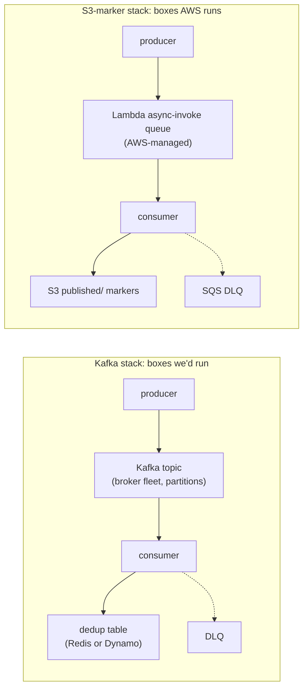

# We skipped Kafka

Queues solve message durability. We needed outcome durability. The two designs land on roughly the same number of boxes, and the only thing that really changes is who runs them.

A few weeks into the project a colleague asked, half-jokingly, whether we'd considered Kafka, the open-source system that sits between programs and ferries a firehose of events from the ones producing them to the ones consuming them. Our pipeline aggregates large windows of log data on a schedule, emits results to a metrics platform, and tries hard never to lose a window. That's the kind of system Kafka is the canonical answer for, and I got asked some version of the same question three or four times before the architecture settled.

This post is the longer version of the answer.

## About the same number of boxes

Here's the part that surprised me when I drew it out: the Kafka design and the design we actually shipped come out to about the same number of moving parts. Every primitive Kafka would give you (each named building block it hands you out of the box) has a counterpart in our stack.

A few of those counterparts lean on AWS services, so it helps to name them up front. AWS Lambda is a service that runs small chunks of your code on demand: each function spins up to handle a single event, does its job, and then vanishes, with nothing kept running between events. We call those functions workers from here on. S3 is Amazon's object storage, basically an enormous, durable bucket of files you read and write by key. And SQS is Amazon's managed queue, a holding pen for messages that something else will pick up later.

Two more words show up in the table below, so here they are first. A producer is just whatever code publishes an event. A consumer is whatever code reads that event and does the work. A dedup table (short for deduplication) is a small store that remembers which pieces of work have already been done, so you don't do them twice. And a DLQ, or dead-letter queue, is the side bin where messages go when the consumer keeps failing to process them, so they're parked for inspection instead of lost or retried forever.

| Kafka primitive             | What it does                                       | Our equivalent                                     | Who runs it    |
| --------------------------- | -------------------------------------------------- | -------------------------------------------------- | -------------- |
| Topic                       | Holds events between producer and consumer         | Lambda async-invoke queue                          | AWS, free      |
| Producer                    | Publishes window-completion events                 | Handler doing `lam.invoke(InvocationType=Event)`   | already exists |
| Consumer                    | Reads events and processes them                    | Downstream Lambda handler                          | already exists |
| Dedup table (Redis, Dynamo) | Tracks which `(asset, window)` keys were processed | `published/<asset>/<window_start>.json` S3 markers | already exists |
| Offset commit log           | Records "this was completely processed"            | `completed/<asset>/<window_start>.json` markers    | already exists |
| Consumer group rebalancer   | Reassigns work when a consumer dies                | Lambda concurrency manager                         | AWS, free      |
| DLQ                         | Catches messages the consumer can't process        | SQS DLQ wired to async-invoke `on_failure`         | already exists |

The correctness properties match up either way. Both stacks promise at-least-once delivery from the producer, which means the system guarantees an event will arrive at the consumer at least one time, though possibly more than once, so the consumer has to be ready to see a duplicate. Both do dedup at the consumer, dropping any repeat so duplicate deliveries don't cause duplicate work. And both leave terminal-state markers downstream, little records that say "this unit of work is finished, for good." I want to be honest about the limit of this framing, though, because the box count flatters it. The boxes on the right are three separate AWS-managed services, each with its own quotas and failure modes. Async-invoke, for one, retries a failed invocation [up to two times](https://docs.aws.amazon.com/lambda/latest/dg/invocation-retries.html) and no further, so the "same boxes" claim holds at the level of architectural shape, not as literal operational equivalence. What it buys you is real all the same: the difference is who runs the substrate (the underlying machinery the whole thing sits on).

The Kafka diagram has three boxes someone on the team is on the hook for. The first is the broker fleet, the cluster of server processes that actually store and hand out the events; brokers are the heart of a Kafka deployment and somebody has to keep them healthy. The second is the dedup table. The third is the partition strategy, the scheme that decides how Kafka splits a topic into parallel lanes called partitions and which lane each event lands in. Each is a multi-day operability problem at minimum. Brokers want monitoring. Dedup tables want TTL policies, rules that automatically expire old entries after some time-to-live so the table doesn't grow forever. Partition strategy wants thought about traffic patterns and consumer affinity (which consumer is pinned to which lane). Every one of those costs is paid for the privilege of getting a primitive that the Lambda runtime already hands us, with semantics we've already validated for the rest of the stack.

## Outcome durability is a consumer-layer property

What we were doing was scheduling a few queries against an archive index every minute. Each query produces a `(asset, window_start)` tuple, a one-hour aggregation result. The aggregation either landed in the metrics platform or it didn't. The question the pipeline has to answer (and the question dashboards, audit reports, and on-call runbooks ask) is _did this 1-hour window for asset X get processed?_

That isn't message durability. Message durability is the promise that a message, once handed in, won't be lost before someone handles it. It lives at the transport layer, the part of the system whose only job is to move messages around; it's a property of the queue. The broker [stores the message durably](https://kafka.apache.org/intro), promises redelivery, and holds it until you ack (acknowledge it, the consumer's signal back to the broker that says "got it, you can stop holding this one"). The consumer can be dumb about idempotency (the property that doing the same operation twice has the same effect as doing it once, so a repeat is harmless) because the buffer is the system of record, the one authoritative place that decides what's true.

Outcome durability lives a layer up, at the consumer. The dedup state has to be keyed by something the consumer can compute (for us, `(asset, window_start)`), and the consumer has to check that state before doing work. This is not a quirk of our design. Kafka's own delivery guarantee is at-least-once by default, and getting to exactly-once (each event taking effect one time, no more, no less) means turning on the idempotent producer, transactions, and [appropriately configured consumers](https://docs.confluent.io/kafka/design/delivery-semantics.html). Even with Kafka in the picture, the exactly-once property you actually care about is something the consumer has to participate in. The buffer's job is reduced to _deliver at least once_; the consumer is the system of record for whether the work happened.

Start the design from outcome durability and you naturally produce something like the `completed/` and `published/` S3 markers we ended up with. Start from message durability and you produce a Kafka topic, and then, because outcome durability is still the actual requirement, you produce a separate dedup table next to it. You've reproduced the markers anyway, just on infra you operate yourself. Durability of the marker store is not the worry, either: S3 is designed for [eleven nines of durability across at least three Availability Zones](https://docs.aws.amazon.com/AmazonS3/latest/userguide/DataDurability.html). "Eleven nines" means 99.999999999 percent, a loss probability so small it's essentially theoretical, and an Availability Zone is one of the physically separate datacenter clusters AWS runs in a region, so spreading across three means a whole building can fail without taking your data with it. That's more than a self-hosted dedup table tends to promise.

The Lambda async-invoke queue gives us at-least-once delivery without any of that. When you invoke with `InvocationType=Event` (the asynchronous, fire-and-forget mode), Lambda [places the event in an internal queue and returns immediately](https://docs.aws.amazon.com/lambda/latest/dg/invocation-async.html), retries on failure, and can hand whatever it can't process to an SQS dead-letter queue. There's no replay-from-offset (no rewinding to an earlier position in the stream to reprocess old events, where an offset is just the numbered position of an event in a topic), no consumer-group fan-out (no broadcasting the same events to several independent reader groups at once), no message ordering. We didn't need any of those. What we needed was narrower: the reconciler (the handler that compares what should have run against what did and decides a window is finished) runs, decides a window is terminal, sends a message to the publisher; if the publisher fails, retry; if it succeeds, leave a marker so the next retry becomes a no-op (an operation that does nothing because the work is already done). Async-invoke does that, and the markers carry the part it can't (durable replay past those two retries lives in the marker layer, not the queue).

## Where Kafka would have earned its keep

Kafka is a good tool for a specific shape of problem; ours just isn't that shape. The cases where reaching for it pays back:

- **Fan-out to multiple independent consumer groups.** Replay an event topic into a billing pipeline, an analytics pipeline, and a dashboard pipeline at different paces. We have one consumer per event.
- **Throughput in the millions of events per second.** We're at hundreds of windows per hour.
- **Replay-across-hours-or-days as the primary recovery mode.** Rewind a topic to T-3-days, replay everything. Our recovery is per-window backfill (reprocessing just the specific windows that are missing), keyed by `(asset, window_start)`, driven by markers, not by topic offsets.
- **Producers and consumers decoupled across teams or services with version skew.** Schema evolution (the message format changing over time) and multi-team data contracts, where a producer and consumer owned by different teams can drift to different versions and still have to interoperate. Ours is a small set of Lambdas in the same repo, deployed together.

If any of those had been load-bearing, Kafka would have been the obvious answer. None were. So we paid for what we needed (markers, async-invoke, S3) and not for what we didn't (broker fleet, dedup table, partition strategy).

## The whiteboard version

If somebody asks the same question and you have ninety seconds, the version that fits is:

> Kafka solves message durability: _this event is safely stored until somebody handles it_. We needed outcome durability: _this window for asset X was processed exactly once_. Different problems. Outcome durability lives at the consumer layer regardless of what queue you put in front of it; you still need a dedup table keyed by `(asset, window)`. Our markers in S3 _are_ that table. Lambda async-invoke gives us at-least-once delivery between two handlers without anything to operate. Adding Kafka would have handed us a substrate to run without changing the primitives the system actually depends on.

Both diagrams on a whiteboard, side by side, tend to settle the conversation in one round.

[Part 3 of this series](/blog/self-healing-needs-a-human-in-the-loop-2026-05) takes on the next architectural choice that falls out of having the right durability primitive: what _recovery_ should mean once a window is detected as missing. The pipeline can retry on its own, or a human can pull the trigger. Both have failure modes, and the right answer is more nuanced than either extreme.

## Further reading

- [Invoking a Lambda function asynchronously](https://docs.aws.amazon.com/lambda/latest/dg/invocation-async.html) and [retry behavior](https://docs.aws.amazon.com/lambda/latest/dg/invocation-retries.html), from the AWS Lambda Developer Guide
- [Kafka delivery semantics](https://docs.confluent.io/kafka/design/delivery-semantics.html), from the Confluent documentation
- [Data durability in Amazon S3](https://docs.aws.amazon.com/AmazonS3/latest/userguide/DataDurability.html), from the Amazon S3 User Guide
